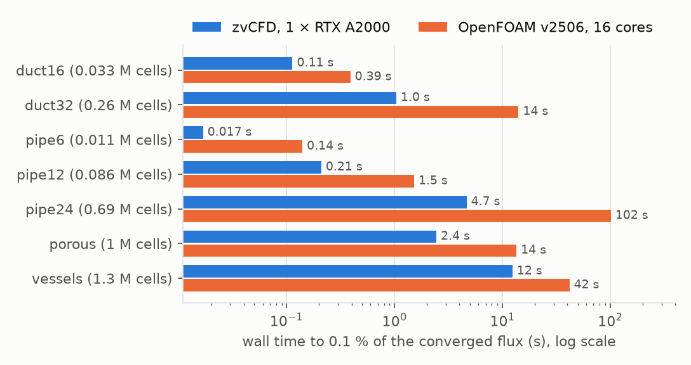
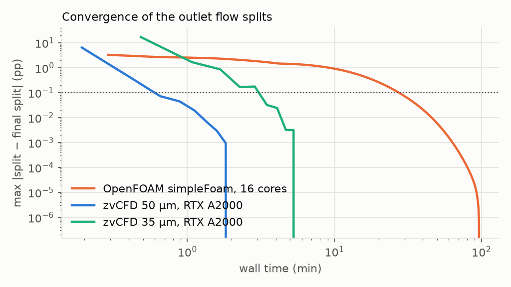

# OpenFOAM comparison

**Question.** On the same problems, on the same workstation, how does
zvCFD compare with OpenFOAM, the most widely used open-source CFD package?
(The agreement of the answers is also part of
[Validation](../validation/cross_code.md).)
The comparison covers the answer each gives and how long each takes to
reach it.

Unlike [Comparison with other packages](comparison.md), which extrapolates,
everything on this page was **run**. Both solvers ran on one workstation,
one job at a time, with nothing else running:

| | zvCFD | OpenFOAM |
|---|---|---|
| Version | this repository (MVP) | ESI OpenFOAM v2506, the official `opencfd/openfoam-default:2506` image run through Apptainer |
| Solver | D3Q19 lattice-Boltzmann, TRT (Λ = 3/16), fp32 | `simpleFoam`, laminar, SIMPLEC (`consistent yes`), GAMG for p, smoothSolver for U, `linearUpwind` convection, 2nd-order Laplacian |
| Hardware | 1 × NVIDIA RTX A2000 12 GB (251 GB/s, 70 W) | 16 MPI ranks on an AMD Threadripper PRO 5955WX (16 cores, 8-channel DDR4) |
| Stops when | flux change between checks < 10⁻⁷ (voxel cases), or < 10⁻⁴ with mass imbalance < 10⁻³ (coronary) | residuals p < 10⁻⁷, U < 10⁻⁸, or the iteration limit |
| Timed | the solve only | `simpleFoam` only (`ExecutionTime`) |

The A2000 and the 16-core Threadripper are a fair pair. Their memory
bandwidths are within 25 % of each other (251 GB/s against ~200 GB/s),
and both codes are memory-bound, so the comparison is mostly one of
algorithms, not hardware.

**The metric** is wall time until the answer is within 1 % and 0.1 % of
that solver's own converged answer: the outlet flux for single-outlet
cases, and every outlet's share of the outflow (in percentage points) for
the coronary tree. It is judged identically for both, from per-iteration
(OpenFOAM) or per-check (zvCFD) histories.

---

## 1. Identical voxel geometries

Both solvers see exactly the same geometry. The OpenFOAM mesh *is* the
fluid voxels, built by `blockMesh` of the box followed by `subsetMesh` to
the fluid cell set, with exposed faces in a `wall` patch. zvCFD's
half-way bounce-back walls lie on the same voxel faces. Steady
pressure-driven Stokes flow (kinematic pressure gradient 0.0125 m/s², water,
10 µm voxels, Re ≪ 1). Pipes are straight circular channels; the porous
sample and the vessel network are the phantoms from the multiresolution
benchmark, with only the component connected to both ends kept.
The porous and vessel samples have four open voxel layers added at each
end, so that neither solver's pressure boundary cuts through the sample.
zvCFD runs every case at τ = 0.8 (see [Numerics](../spec/numerics.md) for
the τ scan). Script: `benchmarks/openfoam/voxel_compare.py`.

| Case | Fluid cells | zvCFD to 0.1 % | OpenFOAM to 0.1 % | Speed-up | Flux zvCFD / OpenFOAM | vs analytic (zvCFD, OpenFOAM) |
|---|---:|---:|---:|---:|---:|---|
| duct, 16 × 16 voxels | 32,768 | 0.11 s | 0.39 s | 3× | 0.989 | 1.004, 1.015 |
| duct, 32 × 32 voxels | 262,144 | 1.0 s | 14 s | 14× | 0.997 | 1.001, 1.004 |
| pipe, radius 6 voxels | 10,752 | 0.017 s | 0.14 s | 8× | 0.974 | 0.958, 0.984 |
| pipe, radius 12 voxels | 86,016 | 0.21 s | 1.5 s | 7× | 0.993 | 0.981, 0.988 |
| pipe, radius 24 voxels | 692,736 | 4.7 s | 102 s | 22× | 0.998 | 0.990, 0.992 |
| porous sample | 1,042,190 | 2.4 s | 14 s | 6× | 1.010 | — |
| vessel network | 1,315,097 | 12 s | 42 s | 3× | 0.990 | — |

"Analytic" is the exact series solution for the square ducts. For the
pipes it is the Poiseuille flux of the circle with the voxel disk's area,
a reference only, because the voxel wall is a staircase.



**The answers agree.** Both solvers converge to the same flux within
1.1 % in every case except the coarsest pipe (6 voxels in radius, 2.6 %).
There, 12 voxels across a vessel is too few for either method. For the
ducts, where an exact solution exists, zvCFD is the closer of the two:
within 0.4 % at 16 voxels across and 0.09 % at 32, against OpenFOAM's
1.5 % and 0.4 % on the same voxel mesh.

**zvCFD gets there 3–22× sooner** on one 70 W GPU than OpenFOAM on 16
cores. The advantage is largest for long tubes, where SIMPLE needs many
iterations to carry the pressure along the tube (22× at radius 24). It is
smallest on the vessel network (3×), whose narrow branches bound the
lattice-Boltzmann time step. OpenFOAM's residual criterion is stricter
than its flux: in the vessel network the flux settled by iteration 400,
but the velocity residual stayed just above 10⁻⁸ until the 5,000-iteration
limit. Only the time to 0.1 % of the final flux is compared.

**What the comparison found in zvCFD.** Two defects, both fixed before
the numbers above were taken:

- *fp32 round-off in slow flows.* Populations differ from their rest
  weights only in the fourth or fifth digit, and fp32 arithmetic on the
  full values lost them. The pipe flux wandered by ±0.1 % for 50,000
  steps, and the porous flux drifted by 12 % with τ. The kernels now store
  and compute `f − w`, and the flux is τ-independent to 10⁻⁵ in tubes.
- *The velocity output of force-driven runs* added half the body force
  where it should have subtracted it: the stored populations are
  post-collision. Plane Poiseuille is now exact to 2 × 10⁻⁶ at every τ,
  and the test tolerance is 10⁻⁴ (previously 1 %).

The boundary treatment also has a caveat. Pressure boundaries through a
porous face made the flux τ-dependent by 7 %; the buffer layers above
bring it under 1 % ([Boundary conditions](../spec/boundary_conditions.md)).

## 2. The HiP-CT coronary tree

The collaborator's case. OpenFOAM runs on the body-fitted Simpleware mesh
(14.8 M polyhedral/tetrahedral cells with boundary layers, imported with
`fluent3DMeshToFoam`, one non-orthogonal corrector). zvCFD runs on voxels
made from the same mesh's wall surface by `zvcfd.geometry` at 50 µm and
35 µm. Both use the same physics: steady laminar Newtonian blood
(ν = 3.5 × 10⁻⁶ m²/s), a flow-rate inlet of 0.194 mL/s (mean 0.1 m/s,
Re ≈ 45), 0 Pa at all 77 outlets, and no-slip walls. Scripts:
`benchmarks/openfoam/coronary.py`, `examples/coronary_50um.yaml`,
`examples/coronary_35um.yaml`.

| Solver | Cells | Hardware | Inlet pressure | Splits within 1 pp | Splits within 0.1 pp |
|---|---:|---|---:|---:|---:|
| OpenFOAM `simpleFoam` | 14,790,642 | 16 cores | 65.7 Pa | 9.3 min | 27.6 min |
| zvCFD, 50 µm | 5,028,753 | 1 × RTX A2000 | 62.7 Pa | 0.4 min | 0.7 min |
| zvCFD, 35 µm | 14,661,804 | 1 × RTX A2000 | 63.1 Pa | 1.7 min | 3.5 min |



**At the same cell count (35 µm voxels against the 14.8 M-cell mesh),
zvCFD settles the 77 outlet splits to 0.1 pp in 3.5 min on one GPU,
against 27.6 min for OpenFOAM on 16 cores: 8× sooner.** At 50 µm it takes
39 s. OpenFOAM needs 11–12 s per SIMPLE iteration on this mesh (34.5 M
faces, non-orthogonality up to 88°, so one non-orthogonal corrector).
That is in line with the ~0.1 M cell-iterations per second per core
reported for OpenFOAM elsewhere. The splits converged by iteration ~250,
and the run was stopped at 500, when they were changing by 0.0016 pp per
100 iterations. Time to 0.1 pp is measured against each solver's own final
splits.

The answers are compared on [Against OpenFOAM](../validation/cross_code.md).
In brief, the 77 splits agree to 0.01 pp on average and 0.1 pp at most,
and the inlet pressure is 4–5 % lower in zvCFD. These are the numbers
after the 2026-09-30 fix to zvCFD's pressure outlets
([Against SimVascular](../validation/simvascular.md#pressure-outlets-on-oblique-caps-found-and-fixed)).
Before it, the largest outlet differed by 2.0 pp (50 µm) and 4.6 pp
(35 µm), and the times were 0.6 and 2.8 min.

---

## Reproducing

```bash
apptainer pull esi2506.sif docker://opencfd/openfoam-default:2506
export FOAM_SIF=$PWD/esi2506.sif               # foamcase.foam() runs every command in it

python benchmarks/openfoam/voxel_compare.py --cases duct16,duct32,pipe6,pipe12,pipe24,porous,vessels
python -c "import sys; sys.path.insert(0,'benchmarks/openfoam'); import foamcase as f; \
           from pathlib import Path; f.import_fluent(Path('foam/coronary'), 'mesh 1.msh')"
python benchmarks/openfoam/coronary.py foam/coronary --procs 16 --end 500
zvcfd run examples/coronary_50um.yaml && zvcfd run examples/coronary_35um.yaml
python benchmarks/openfoam/report.py --coronary-foam foam/coronary \
       --coronary-zvcfd runs/coronary-50um-*.zvcfd runs/coronary-35um-*.zvcfd
```

Four things went wrong on the way. Each would have silently given a wrong
comparison, so they are recorded here:

- `subsetMesh -patch walls` **creates** the patch if it does not exist, as
  type `empty`: frictionless, and OpenFOAM then converged to a flux 1,700×
  too large. The voxel cases declare an empty `walls` patch of type `wall`
  in `blockMeshDict`, and write `0/` only after subsetting.
- `subsetMesh -overwrite` rewrites the fields in `0/`, so boundary
  conditions must be written after it.
- Running zvCFD while `simpleFoam` held all 16 cores made zvCFD ~3× slower
  (its launch thread competed with busy-polling MPI ranks). Every timing
  here comes from runs made one at a time.
- **The conda-forge build of OpenFOAM v2412 is wrong for this problem.** Its
  `simpleFoam` and `pimpleFoam` converged to 0.81× the flux of the same
  finite-volume discretisation. The error was the same at every resolution
  (duct 16²: 0.816; duct 32²: 0.806; pipes 0.80× Poiseuille) and every
  duct length. Changing the relaxation, gradient scheme, viscosity or
  inlet type did not remove it. The same build's `icoFoam`, run to steady
  state, gave the exact finite-volume flux. The official v2412 and v2506
  images, on the identical case directory, both give the exact value
  (2.92209935 × 10⁻¹³ m³/s for duct 16²). The fault is in that build, not
  in OpenFOAM, so this page uses the official v2506 image. Check a
  packaged CFD build against an exact solution before timing it.
