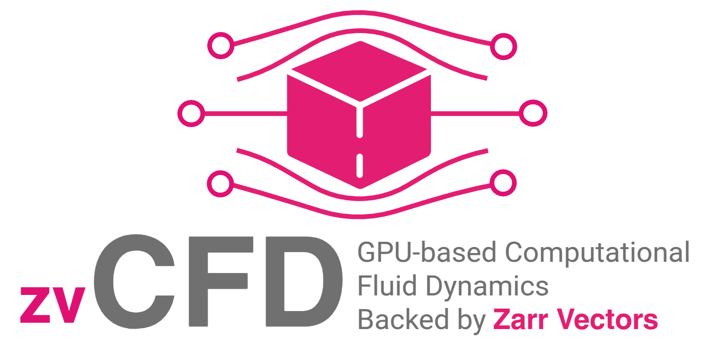

.. zvCFD documentation master file

----

**zvCFD** solves blood flow and other laminar flows on GPUs, with every
geometry, mesh and result held in chunked `Zarr Vectors
<https://zarr-vectors-py.readthedocs.io>`_ stores and every run published as
an OME-NGFF RFC-8 collection. It has two solvers.

**The finite-volume solver** is the main one. It is CFX-style: element-based,
vertex-centred finite volumes on the mesh itself (tetrahedra, prisms,
pyramids, hexahedra), with pressure and velocity solved coupled and
algebraic multigrid on the GPU. Any mesh (Ansys Fluent, VTK, SimVascular,
or Gmsh through meshio) is imported once into a Zarr Vectors mesh
collection, and the solver runs from it. On SimVascular's published
coronary model it matches SimVascular's outlet flows to 0.5 % and its
velocity field to 1.3–1.8 % through a cardiac cycle
(:doc:`validation/simvascular`).

**The lattice-Boltzmann solver** works on voxels. It solves directly on
large OME-Zarr segmentations with no meshing step, storing only the bricks
that contain fluid, so memory follows the fluid volume rather than the
bounding box. It is the route to image-native resolutions beyond what a
mesh and its matrix can hold.

The package is at **v0.1**. It has:

- the finite-volume solver: steady and transient (BDF2), flow-rate and
  velocity inlets, pressure, RCR and coronary outlets coupled implicitly,
  backflow stabilisation, Carreau–Yasuda blood, wall shear stress evaluated
  as CFX does (TAWSS, OSI, RRT), an optional RANS turbulence model (k-kL,
  one GPU), and partitions for several GPUs (verified so far as several
  partitions on one GPU);
- the lattice-Boltzmann solver: sparse-brick D3Q19 (TRT), with the same
  outlet models, on one or several GPUs;
- mesh collections, brick stores and run collections on Zarr Vectors;
- the ``zvcfd`` command line, where ``solver.method: auto`` picks the
  finite-volume solver for mesh sources and the lattice-Boltzmann solver
  for voxel sources.

Both solvers are :doc:`validated <validation/index>` against exact
solutions, standard benchmarks, OpenFOAM and SimVascular. Not yet done: the
HiP-CT coronary tree against the collaborator's Ansys CFX case (an H100
job), and timing on the 8 × H100 node. :doc:`feasibility/index` sets out the
evidence, and :doc:`feasibility/roadmap` the order of work.

zvCFD keeps the conventions of the packages it sits on. It writes stores
only through ``zarr_vectors.building``, the supported surface for code that
builds stores, and follows its three-phase parallel-write contract; it
reads OME-Zarr with ``zarr`` directly, as BRIDGE does; its command line
follows ``zvtools`` and ``bridge-sim``; and it probes capabilities rather
than parsing versions.

----

| `Source code on GitHub <https://github.com/Andrew-Keenlyside/zvCFD>`__

Where to start
--------------

.. list-table::
   :widths: 35 65

   * - :doc:`getting_started/quickstart`
     - Solve on a mesh with the finite-volume solver, then on voxels with
       the lattice-Boltzmann solver.
   * - :doc:`tutorials/fv_mesh`
     - The finite-volume solver on a mesh: import, a transient run with an
       RCR outlet, and the results.
   * - :doc:`validation/simvascular`
     - Both solvers against SimVascular's published coronary model, through
       a whole cardiac cycle.
   * - :doc:`feasibility/index`
     - Is a Zarr-Vectors-backed multi-GPU CFD package feasible? The verdict,
       the measurements behind it, and what it would take.
   * - :doc:`getting_started/concepts`
     - Meshes and control volumes; bricks, chunks and workers; snapshots and
       the run collection.
   * - :doc:`validation/index`
     - Exact, manufactured and benchmark solutions for both solvers,
       OpenFOAM and SimVascular, with orders of accuracy and what byte
       identity does and does not mean.
   * - :doc:`benchmarks/openfoam`
     - Measured against OpenFOAM on the same workstation: identical voxel
       geometries and the HiP-CT coronary tree.
   * - :doc:`benchmarks/comparison`
     - Estimated speed against Fluent, CFX, STAR-CCM+, OpenFOAM, SimVascular and
       GPU-native lattice-Boltzmann codes, with the assumptions behind each number.
   * - :doc:`spec/index`
     - The numerics of both solvers and the on-disk layout: mesh
       collections, brick stores, run collections, snapshots and the
       parallel I/O contract.
   * - :doc:`api/index`
     - Python and command-line reference.

.. toctree::
   :maxdepth: 2
   :hidden:

   getting_started/index
   feasibility/index
   spec/index
   validation/index
   tutorials/index
   how_to/index
   benchmarks/index
   api/index
   credits
   references
