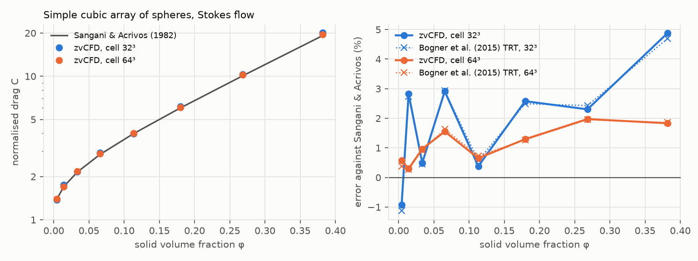

# Standard benchmarks

Two cases with no closed-form solution, but with reference values that
the literature treats as exact: Stokes drag on regular sphere arrays
(porous media) and the DFG cylinder benchmark (forces on a curved body).
Both are standard tests for a new solver, and the first also has a
published lattice-Boltzmann result to compare with point by point.

## Porous media: arrays of spheres

Stokes flow through a simple cubic array of spheres, one sphere per
periodic cell of 32³ or 64³ (`sphere_array`). The reference is Sangani &
Acrivos (1982), the standard analytic result for regular arrays. Their
values and definitions are taken as tabulated by Bogner, Mohanty & Rüde
(2015), whose own TRT lattice-Boltzmann results at the same two
resolutions allow a direct comparison. The normalised drag is
`C = f_t / (3π μ d ū)`, where f_t is the total force per sphere (the
driving force per cell at balance) and ū the superficial velocity.

| φ | 0.004 | 0.014 | 0.034 | 0.065 | 0.113 | 0.180 | 0.268 | 0.382 |
|---|---:|---:|---:|---:|---:|---:|---:|---:|
| Sangani & Acrivos C | 1.385 | 1.699 | 2.150 | 2.845 | 3.974 | 6.002 | 10.05 | 19.16 |
| zvCFD, 32³ | −0.9 % | +2.8 % | +0.5 % | +2.9 % | +0.4 % | +2.6 % | +2.3 % | +4.9 % |
| Bogner et al., 32³ | −1.1 % | +2.7 % | +0.5 % | +2.9 % | +0.6 % | +2.5 % | +2.4 % | +4.7 % |
| zvCFD, 64³ | +0.6 % | +0.3 % | +1.0 % | +1.6 % | +0.6 % | +1.3 % | +2.0 % | +1.8 % |
| Bogner et al., 64³ | +0.4 % | +0.3 % | +0.9 % | +1.6 % | +0.7 % | +1.3 % | +2.0 % | +1.9 % |

zvCFD is within 2 % of the analytic drag on the 64³ cell and within 5 %
on the 32³ cell, from dilute to dense arrays. It reproduces the published
code's errors, point by point, to about 0.2 percentage points. The
remaining error is voxelisation of the sphere, which moves the
hydrodynamic radius by a fraction of a cell and so is not monotone in φ.

## Flow past a cylinder: DFG benchmark 2D-1

The standard steady benchmark of Schäfer & Turek (1996) (`cylinder`): a
cylinder of diameter D, off-centre in a channel 4.1 D high. The inflow is
parabolic, Re = U_mean D/ν = 20, and the outflow is at 22 D. The
reference values are the high-accuracy ones (FeatFlow; John & Matthies
2001): C_D = 5.57954, C_L = 0.0106189, Δp = 0.117520. zvCFD runs it as a
quasi-2-D case, 8 cells thick and periodic across, with a parabolic
velocity patch at the inlet and a pressure patch at the outlet. Forces
come from momentum exchange on the staircase cylinder.

| D (cells) | fluid cells | τ | lattice Mach | C_D | C_L | Δp |
|---:|---:|---:|---:|---:|---:|---:|
| 20 | 0.29 M | 0.62 | 0.10 | 5.779 (+3.6 %) | 0.01048 (−1.3 %) | 0.1165 (−0.9 %) |
| 40 | 1.14 M | 0.74 | 0.10 | 5.683 (+1.9 %) | 0.01040 (−2.1 %) | 0.1171 (−0.35 %) |
| 80 | 4.58 M | 0.98 | 0.10 | 5.668 (+1.6 %) | 0.01083 (+2.0 %) | 0.1180 (+0.44 %) |
| 40 | 1.14 M | 0.62 | 0.05 | 5.628 (+0.9 %) | 0.01037 (−2.4 %) | 0.1159 (−1.4 %) |
| reference | | | | 5.5795 | 0.010619 | 0.11752 |
| Schäfer–Turek acceptance interval | | | | 5.57–5.59 | 0.0104–0.0110 | 0.1172–0.1176 |

The drag is within 2 % from 40 cells across, but it does not reach the
acceptance interval, which is ±0.2 %. Two errors make up the difference:

- **Compressibility.** With the lattice Mach number held at 0.10, the
  drag error stops falling (+1.9 % at D = 40, +1.6 % at D = 80). Halving
  the Mach number at D = 40 halves it, to +0.9 %. Converging the drag
  therefore needs the Mach number lowered with the grid (diffusive
  scaling), at the cost of more steps.
- **The staircase cylinder**, which moves the effective surface by up to
  half a cell. Lift, a small difference of large surface forces, and Δp,
  two point values next to the cylinder, scatter by about ±2 % and ±1 %
  without a clear trend: that is the signature of a staircase body.

Interpolated bounce-back (Bouzidi et al. 2001), which places the wall at
its true position within each cell, is the standard remedy for the second,
and is on the [roadmap](../feasibility/roadmap.md). For zvCFD's
applications, where flows and pressures matter more than forces on
walls, the lesson is to keep the lattice Mach number near 0.05 for a
steady result that should be accurate to 1 %.
