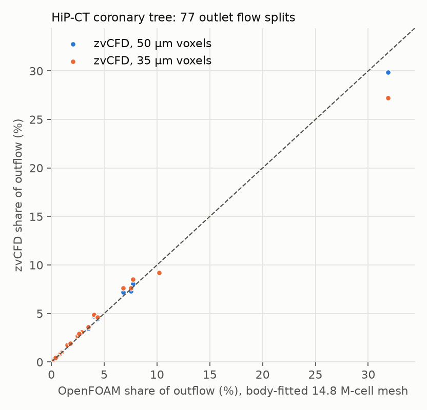

# Against OpenFOAM

The exact solutions test the solver one mechanism at a time. A
cross-code comparison tests the whole pipeline on the problem it is meant
for. Here zvCFD is compared with OpenFOAM v2506 (the official
`opencfd/openfoam-default:2506` image, laminar `simpleFoam`) on two kinds
of problem:

- identical voxel geometries, where the two solvers see exactly the same
  staircase walls;
- the HiP-CT coronary tree, where OpenFOAM runs on the collaborator's
  body-fitted 14.8 M-cell mesh and zvCFD on voxels made from the same
  mesh's surface.

Speed is reported on [OpenFOAM comparison](../benchmarks/openfoam.md);
this page is about the answers.

**Two different methods cannot give byte-identical results, and should
not be expected to.** zvCFD is a lattice-Boltzmann method on voxels.
OpenFOAM is a finite-volume method on a mesh. Each has its own
discretisation error, and they converge to the same solution only as both
grids are refined. Agreement is therefore judged against tolerances.
Byte identity is the right test only for *reproducibility*, within one
code on one platform (see [Reproducibility](#reproducibility)).

---

## Identical voxel geometries

Steady pressure-driven Stokes flow, the same voxels for both codes
(OpenFOAM's mesh is the fluid voxels themselves: `blockMesh` followed by
`subsetMesh`). Full setup on [OpenFOAM comparison](../benchmarks/openfoam.md).

| Case | Fluid cells | Flux, zvCFD / OpenFOAM | zvCFD vs analytic | OpenFOAM vs analytic |
|---|---:|---:|---:|---:|
| square duct, 16 across | 32,768 | 0.989 | +0.37 % | +1.50 % |
| square duct, 32 across | 262,144 | 0.997 | +0.09 % | +0.38 % |
| pipe, radius 6 | 10,752 | 0.974 | −4.2 % | −1.6 % |
| pipe, radius 12 | 86,016 | 0.993 | −1.9 % | −1.2 % |
| pipe, radius 24 | 692,736 | 0.998 | −1.0 % | −0.8 % |
| porous sample | 1,042,190 | 1.010 | — | — |
| vessel network | 1,315,097 | 0.990 | — | — |

The two codes agree within 1.1 %, except in the coarsest pipe (2.6 %).
Where an exact solution exists (the ducts), zvCFD is the closer of the
two. For the pipes, "analytic" is Poiseuille flow in the circle with the
voxel disk's area. That is only a reference, because a staircase wall has
no single equivalent radius.

## The HiP-CT coronary tree

Steady laminar flow of Newtonian blood (ν = 3.5 × 10⁻⁶ m²/s) at
0.194 mL/s into the inlet (Re ≈ 45), with 0 Pa at all 77 outlets.
OpenFOAM ran 500 SIMPLE iterations on 16 cores, by which point the splits
changed by 0.0016 percentage points (pp) per 100 iterations. zvCFD ran at
50 µm (5.0 M fluid voxels) and 35 µm (14.7 M, about the mesh's cell
count), each converged to a flux change below 10⁻⁴ with inflow equal to
outflow to 10⁻⁴.

| | OpenFOAM | zvCFD 50 µm | zvCFD 35 µm |
|---|---:|---:|---:|
| inlet pressure | 65.7 Pa | 65.6 Pa (−0.2 %) | 67.4 Pa (+2.5 %) |
| mean \|split difference\| over 77 outlets | — | 0.08 pp | 0.15 pp |
| largest outlet (cor_outlet_074) | 31.9 % | 29.9 % | 27.2 % |
| next four outlets | 10.2, 7.7, 7.5, 6.8 % | 9.3, 8.0, 7.3, 7.2 % | 9.2, 8.5, 7.6, 7.6 % |

The inlet pressure, which measures the tree's total resistance, agrees
within 0.2 % at 50 µm. The 76 smaller outlets agree to a small fraction
of a percentage point. The exception is the largest outlet, at the end of
the main trunk: zvCFD gives it 2.0 pp less flow than OpenFOAM at 50 µm and
4.6 pp less at 35 µm, and the other large branches take up the
difference.

**This difference is not yet explained.** It grows with refinement, so it
is not zvCFD's discretisation error shrinking towards OpenFOAM's answer.
What has been ruled out:

| Candidate | Test | Result |
|---|---|---|
| Outlet 074 badly voxelised | patch voxels × voxel area against the mesh's outlet area | 1.20 (50 µm) and 1.18 (35 µm), the same as the other large outlets |
| Backflow at the outlet (OpenFOAM's `inletOutlet` blocks it, zvCFD's pressure patches allow it) | reversed normal velocity on every outlet's patch voxels | none, at any outlet |
| Inlet profile | both codes impose a plug at the prescribed flow rate | same |
| Compressibility (lattice Mach number) | 50 µm at τ = 0.55, 0.6, 0.7 (Mach 0.04, 0.08, 0.17) | outlet 074: 28.97, 29.85, 30.22 %; inlet pressure 67.9, 65.6, 64.7 Pa |

The τ runs show that zvCFD's answer at a fixed resolution moves by up to
1.3 pp with τ, less than the gap. The change is not proportional to the
Mach number squared (it saturates), so it is not compressibility. Its
likely source is the same one that made a porous face τ-dependent: the
non-equilibrium extrapolation at inlet and outlet patches that cut
obliquely through voxels ([Boundary conditions](../spec/boundary_conditions.md)).
Lowering the Mach number moves outlet 074 *away* from OpenFOAM.

Three further tests would locate it:

1. Compare the flow through cross-sections along the main trunk in both
   codes, to find the bifurcation where the split first diverges.
2. Add short straight flow extensions to the outlets (standard practice
   in cardiovascular CFD, and used by SimVascular), in both codes, so the
   pressure boundaries sit in developed flow.
3. Refine further: 25 µm (40 M voxels) and 20 µm on the H100 node, and
   interpolated bounce-back.

Until then, zvCFD's splits for this tree should be quoted as agreeing
with OpenFOAM to 0.1–0.2 pp on average, with a 2–5 pp disagreement at
the dominant outlet.

## Reproducibility

Which results *should* be byte-identical, and are they? Each claim below
was tested.

| Comparison | Byte-identical? | Measured |
|---|---|---|
| zvCFD, the same run repeated (same code, same GPU) | **yes** | every field chunk of every snapshot, every monitored flow and `patches.csv`. Only the run id and the wall-clock timings differ (`tests/test_reproducibility.py`) |
| zvCFD on 1 GPU vs split across partitions | **yes** | bit-identical fields (`tests/test_physics.py`) |
| zvCFD on different GPU models or drivers | not guaranteed | kernels are compiled per architecture, and instruction selection can change the last bit; compare with a tolerance (10⁻⁶ relative is ample) |
| OpenFOAM, the same run repeated, `scotch` decomposition | **no** | scotch cut the mesh differently on all 16 processors; the histories differ from the first iteration (second pressure residual 0.1330 vs 0.1351) and the runs stop at 1,506 and 1,505 iterations; the converged flux agrees to 3.4 × 10⁻⁹ |
| OpenFOAM, the same run on the *same* decomposition | **yes** | U, p and φ on all 16 processors, and the flux history |
| OpenFOAM on 16 ranks vs serial | no | converged flux agrees to 6.8 × 10⁻⁹ (the solver tolerance) |
| zvCFD vs OpenFOAM | no, by construction | agreement within the tolerances above |

zvCFD is deterministic by design. Every cell is updated independently, so
the order of floating-point operations is fixed. The one reduction that
feeds back into a run, the per-patch flux behind flow-rate control, is
summed on the host in a fixed order: GPU atomic additions happen in no
fixed order and could change the last bit between runs.

**For a validation dataset** this means:

- Store each reference quantity with a tolerance, and judge agreement
  across codes, versions and hardware against that tolerance.
- Byte identity is a regression check for one code on one platform. It
  is worth keeping (a SHA-256 of each field chunk costs nothing), but
  record the code version, GPU model, driver and, for OpenFOAM, the
  decomposition with it.
- To make OpenFOAM runs byte-reproducible, keep the decomposed case
  (`processor*/constant`), or use a deterministic decomposition method
  (`simple` or `hierarchical`) instead of `scotch`.

## Reproducing

The commands are on [OpenFOAM comparison](../benchmarks/openfoam.md#reproducing);
the byte-identity checks are `pytest tests/test_reproducibility.py`.
