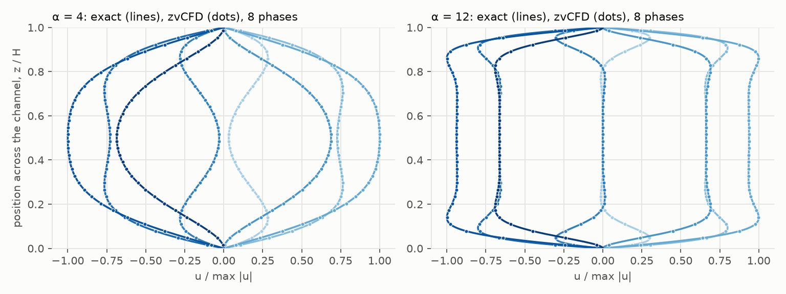
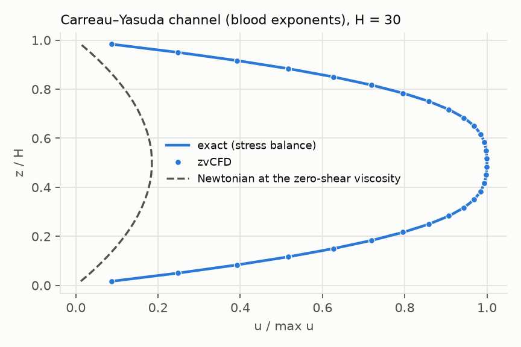

# Exact solutions

Flows whose solution is known in closed form (or, for the shear-thinning
channel, to quadrature precision). They check that zvCFD solves the
equations it claims to solve, and they measure the **order of accuracy**:
how fast the error falls as the grid is refined. The overview, and the
convergence figure for all of them, is in [Validation](index.md).

## Steady channels

**Plane Poiseuille** (`poiseuille`). A body force drives flow between
plates 6, 14 and 30 cells apart, periodic along the flow, at τ = 0.55, 0.8
and 2. The exact profile is `u = F ζ (H − ζ) / 2ν`, with the walls
half-way between the last fluid and first solid cell. The largest error is
4 × 10⁻⁵ and does not depend on τ. It is the fp32 floor of a steady state
reached through 10⁴–10⁵ steps.

**Pressure-driven** (`poiseuille_pressure`). The same channel, driven by
pressure patches (Guo non-equilibrium extrapolation) at the two ends
instead of a body force. The profile halfway along matches the exact one
for the local pressure gradient to 3–7 × 10⁻⁶. That gradient equals the
nominal one, (p_in − p_out)/(n_x − 1), to four digits.

**Square duct** (`duct`). Periodic along the duct, body-force driven,
6–62 cells across. The reference is the Fourier series of White (2006)
eq. 3-48, evaluated with 200 terms. Second order: 7.9 × 10⁻³ → 7.9 × 10⁻⁵,
and the flux error falls from 2.4 % to 2 × 10⁻⁴.

**Hagen–Poiseuille pipe** (`pipe`). A voxelised disk of radius 4–32 cells
(cell centres inside the circle are fluid). The staircase makes the
effective radius differ from the nominal one by up to half a cell, so
convergence is first order and not monotone: flux +4.3 %, +4.7 %, +0.6 %,
−0.15 %.

## Pulsatile flow: Womersley

The canonical cardiovascular test (`womersley`). A body force
`F₀ cos ωt` drives a channel or a pipe. After the start-up transient has
decayed, the velocity is the exact periodic solution of Womersley (1955):
`cosh` profiles in a channel and Bessel `J₀` profiles in a pipe. Two
Womersley numbers are used: α = 4 (a coronary artery) and α = 12 (the
aorta, with thin oscillating boundary layers). The grids are refined in
diffusive scaling (the period grows with the square of the width), and
the error is measured over the whole final period.

| | 16 cells across | 32 | 64 | order |
|---|---:|---:|---:|---:|
| channel, α = 4 | 7.1 × 10⁻⁴ | 1.7 × 10⁻⁴ | 4.1 × 10⁻⁵ | 2.1 |
| channel, α = 12 | 7.3 × 10⁻³ | 1.0 × 10⁻³ | 2.2 × 10⁻⁴ | 2.5 |
| pipe, α = 4 | 4.0 × 10⁻² | 1.2 × 10⁻² | 6.2 × 10⁻³ | 1.3 |
| pipe, α = 12 | 8.1 × 10⁻² | 3.0 × 10⁻² | 1.6 × 10⁻² | 1.2 |

In the channel, the time-dependent forcing, the phase lag and the
Stokes-layer overshoot are all second-order accurate, even at α = 12 with
28 steps per period on the coarsest grid. The pipe errors are the
staircase again. They are largest at α = 12, where the boundary layer is
only a few cells thick and the staircase sits inside it.

## Taylor–Green vortex

A decaying array of vortices in a periodic box (`taylor_green`),
`u = −U cos kx sin ky e^(−2νk²t)` and its companions. This is an exact
solution of the full nonlinear Navier–Stokes equations, pressure included.
It has no walls, so it isolates the bulk scheme. The grids run from 16² to
256² at fixed Re = 6.4, with U ∝ 1/N (diffusive scaling), and the error
is measured after one e-folding time.

| N | velocity, equilibrium start | pressure, equilibrium start | velocity, consistent start | pressure, consistent start |
|---:|---:|---:|---:|---:|
| 16 | 1.6 × 10⁻² | 1.5 × 10⁻¹ | 1.2 × 10⁻³ | 6.4 × 10⁻² |
| 32 | 3.9 × 10⁻³ | 6.1 × 10⁻² | 4.1 × 10⁻⁴ | 1.6 × 10⁻² |
| 64 | 9.8 × 10⁻⁴ | 2.7 × 10⁻² | 9.5 × 10⁻⁵ | 4.5 × 10⁻³ |
| 128 | 2.3 × 10⁻⁴ | 1.7 × 10⁻² | 3.6 × 10⁻⁵ | 9.4 × 10⁻⁴ |
| 256 | 1.7 × 10⁻⁵ | 3.5 × 10⁻³ | 7.9 × 10⁻⁵ | 5.2 × 10⁻⁴ |
| order (16–128) | **2.0** | 1.1 | 1.7 | **2.0** |

The velocity is second order (equilibrium start; from the consistent
start its errors are 5–10× smaller and reach the fp32 floor by 128²). The
pressure is second order only from a *consistent* start (Mei et al. 2006):

- the first-order non-equilibrium populations, scaled by (1 − ω) because
  the buffers hold post-collision values;
- a small velocity divergence, `u += −3ν∇p`. The weakly compressible
  solver needs this divergence while the pressure decays. Without it, the
  first step launches a sound wave in the pressure mode, of relative size
  ~2νk/c_s ∝ 1/N, which is exactly the first-order pressure error seen
  with the equilibrium start.

At 256² both starts reach the fp32 round-off floor (about 10⁻⁵ in
velocity, with U = 0.0025), so the orders are fitted from 16 to 128.

## Shear-thinning rheology

A body-force-driven channel with Carreau–Yasuda viscosity
(`carreau_channel`), using the blood exponents (a = 2, n = 0.3568) and
ν₀/ν∞ = 16.2. The wall Carreau number λγ̇ is 50, so the fluid is strongly
shear-thinning: the peak velocity is 5.4 times the Newtonian one at the
zero-shear viscosity. The reference is exact for *any* rheology. The
momentum balance fixes the shear stress, `ν(γ̇) γ̇ = F y`, so γ̇(y) comes
from a root-find and u(y) from its integral (SciPy, to 10⁻¹²). The grids
are refined in diffusive scaling (λ ∝ H², F ∝ H⁻³).

The error falls from 5.3 × 10⁻³ to 1.1 × 10⁻³ to 1.6 × 10⁻⁴ (H = 14, 30,
62), an order of 2.3. The finest value is the fp32 floor of this steady
state: twenty fixed iterations give the same 1.7 × 10⁻⁴.

**This case found a defect.** The kernel finds each cell's viscosity by
fixed-point iteration, because ω depends on the shear rate, which depends
on ω. Three iterations from the zero-shear value left about 1 % error in ω
where the thinning is strong. The profile error then stalled at 0.6 % and
did not fall with resolution (orders 0.4). The kernel now iterates until ω
settles to 10⁻⁶, at most 12 times. That is as accurate as twenty fixed
iterations, and faster than a fixed three, because a cell at low shear
settles in one or two ([Kernels](../benchmarks/kernels.md)).
