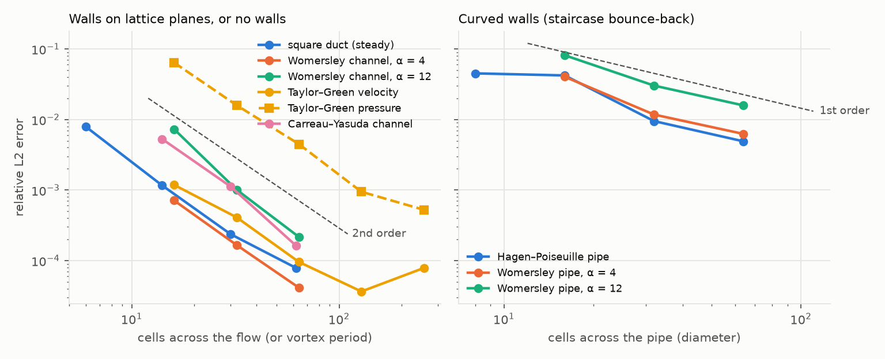

# Validation

**Question.** Does zvCFD solve the equations it claims to solve? How fast
does its error fall as the grid is refined? And on a real case, does it
give the same answer as an established solver?

The evidence comes in three layers, from the most controlled to the most
realistic:

| Layer | Page | Reference | What it establishes |
|---|---|---|---|
| Finite-volume solver (the main solver), validated on meshes that fit one GPU | [Finite-volume solver](fv_solver.md) | exact, manufactured and benchmark solutions on unstructured meshes; OpenFOAM on the same mesh | the numbers: orders, errors, invariances, GPU agreement, defects found |
| | [Verification and validation](vv_plan.md) | the V&V evidence for the CFX-style solver, by ASME V&V 20 / 40 layer | what is established, prepared and missing |
| | [Against SimVascular](simvascular.md#the-finite-volume-solver) | SimVascular's published results, on SimVascular's own mesh | the same pulsatile flow, velocity and wall shear stress through a whole cardiac cycle |
| Lattice-Boltzmann solver: exact solutions | [Exact solutions](exact_solutions.md) | closed-form solutions of the Navier–Stokes equations | the equations are solved, and to what order of accuracy |
| Lattice-Boltzmann solver: standard benchmarks | [Standard benchmarks](benchmarks.md) | literature reference values (Sangani & Acrivos; Schäfer & Turek) | accuracy on porous-media drag and on forces on a curved body |
| Lattice-Boltzmann solver: cross-code comparison | [Against OpenFOAM](cross_code.md) | OpenFOAM v2506 on the same problems | the same answers on identical voxel geometries and on the HiP-CT coronary tree |
| | [Against SimVascular](simvascular.md) | SimVascular's published results for a patient coronary model (VMR `0066_H_CORO_H`) | the same pulsatile flow, velocity and wall shear stress through a whole cardiac cycle |

The lattice-Boltzmann cases use the production kernels: D3Q19, TRT with Λ = 3/16, fp32
arithmetic on shifted populations, half-way bounce-back walls, Guo forcing
and Guo non-equilibrium-extrapolation inlets and outlets. The exact and
reference solutions are in `benchmarks/validation/exact.py`, independent
of the solver. The cases themselves are in `benchmarks/validation/cases.py`,
raw results in `benchmarks/results/validation/`, and fast versions run in
the test suite (`tests/test_validation.py`).

---

## Finite-volume solver: summary

The finite-volume solver is validated on meshes that fit one GPU. The
numbers are on [Finite-volume solver](fv_solver.md); the evidence is
organised by ASME V&V 20 / 40 layer on
[Verification and validation](vv_plan.md).

| Evidence | Result |
|---|---|
| Manufactured solutions and exact Navier–Stokes flows (Kovasznay, Womersley, Ethier–Steinman), unstructured and warped meshes | velocity second order; BDF2 second order in time |
| DFG 2D-1 cylinder (Schäfer & Turek) | drag coefficient +0.23 %, pressure drop +0.35 % (21,680 nodes) |
| Lid-driven cavity, Re = 100 and 400 (Ghia et al.) | centreline velocity RMS 0.003–0.007 at 64² |
| Developed pipe flow against OpenFOAM on the same mesh | zvCFD 0.5–0.7 % from the exact flow rate, OpenFOAM 5.8–6.8 % |
| Wall shear stress (CFX's wall-gradient method) | exact for linear fields on every element type; within 2 % of Poiseuille with prism layers at R/32 |
| SimVascular coronary model, one cardiac cycle, SimVascular's mesh | outlet flows 0.5 % (2.2 % max), velocity 1.3–1.8 %, TAWSS 3.1 % ([Against SimVascular](simvascular.md#the-finite-volume-solver)) |

Pending: the HiP-CT coronary tree against the collaborator's Ansys CFX run
(the main target; it needs an H100), coronary runs at H100 scale, scaling
across GPUs, and DFG 2D-2 (vortex shedding).

## Lattice-Boltzmann solver: summary

| Case | Reference | Exercises | Error on the finest grid | Observed order |
|---|---|---|---|---:|
| Plane Poiseuille, body force, τ = 0.55–2 | exact | walls, forcing, τ-independence | 3 × 10⁻⁷ – 4 × 10⁻⁵ | exact to round-off |
| Plane Poiseuille, pressure patches, τ = 0.6–2 | exact | pressure boundaries | 3 – 7 × 10⁻⁶ | exact to round-off |
| Square duct | series (White) | 3-D walls | 7.9 × 10⁻⁵ (62 cells across) | 2.0 |
| Womersley channel, α = 4 / 12 | exact (Womersley) | pulsatile flow, time accuracy | 4.1 × 10⁻⁵ / 2.2 × 10⁻⁴ | 2.1 / 2.5 |
| Taylor–Green vortex | exact Navier–Stokes | nonlinear terms, pressure | velocity 3.6 × 10⁻⁵, pressure 9.4 × 10⁻⁴ (128²) | 2.0 / 2.0 |
| Carreau–Yasuda channel (blood exponents) | exact (stress balance) | shear-thinning rheology | 1.6 × 10⁻⁴ | 2.3 |
| Hagen–Poiseuille pipe | exact | curved walls (staircase) | 4.9 × 10⁻³; flux −0.15 % (64 cells across) | 1.2 |
| Womersley pipe, α = 4 / 12 | exact (Bessel) | pulsatile flow, curved walls | 6.2 × 10⁻³ / 1.6 × 10⁻² | 1.3 / 1.2 |
| Simple cubic array of spheres, φ = 0.004–0.38 | Sangani & Acrivos | porous-media drag | within 2.0 % (64³ cell); matches a published TRT code | — |
| Cylinder in a channel, Re = 20 (DFG 2D-1) | Schäfer & Turek | drag, lift, Δp on a curved body | drag +0.9 to +1.9 %, lift ±2 %, Δp ±1.4 % (40–80 cells across) | — (staircase and Mach) |
| Voxel ducts, pipes, porous sample, vessel network | OpenFOAM v2506, same voxels | whole solver, pressure-driven | fluxes agree within 1.1 % (2.6 % in the coarsest pipe) | — |
| HiP-CT coronary tree, 77 outlets | OpenFOAM v2506, 14.8 M-cell body-fitted mesh | whole pipeline from the Fluent mesh | see [Against OpenFOAM](cross_code.md) | — |
| VMR coronary trees, 24 outlets, pulsatile | SimVascular (svSolver), 3.8 M tetrahedra | whole pipeline from a SimVascular surface, a full cardiac cycle | lattice Boltzmann (60 µm): outlet flows 1.3 % on average (4.2 % max), pressure drop +0.4 / +2.8 %, velocity 5.4 %, TAWSS 5.8 %; finite volume (SimVascular's mesh): outlet flows 0.5 % (2.2 % max), pressure drop +1.0 / +1.9 %, velocity 1.6 %, TAWSS 3.1 % (own method 3.7 %) | — (see [Against SimVascular](simvascular.md)) |

Errors are relative L2 norms over the fluid (or over a period, for the
pulsatile cases) unless stated. The Taylor–Green orders are the velocity
from an equilibrium start and the pressure from a consistent start (see
[Exact solutions](exact_solutions.md#taylorgreen-vortex)).



**Where the walls lie on lattice planes, or there are none, zvCFD is
second-order accurate.** This holds in space and time, for steady and
pulsatile flow, for the nonlinear Navier–Stokes terms and for the
shear-thinning rheology. Plane Poiseuille flow is reproduced exactly (to
fp32 round-off) at every τ tried, the defining property of TRT with
Λ = 3/16.

**Curved walls are first order**, because a voxel wall is a staircase:
flux errors in a pipe fall from 4 % at 8 cells across to 0.15 % at 64.
This is the known limit of half-way bounce-back, and the reason
interpolated bounce-back is on the [roadmap](../feasibility/roadmap.md).
By this test a straight vessel needs about 30 voxels across for its flow
to be accurate to 1 %. In the coronary tree at 50 µm, the smallest outlets
are 5 voxels across and the inlet is 31.

**Porous-media drag is within 2 %** of the analytic result for regular
sphere arrays on a 64³ cell. zvCFD reproduces a published TRT code's
errors point by point.

## Defects the validation found

Validation is only useful if it can fail. It did, five times, and each
defect is fixed in the numbers on these pages:

| Found by | Defect | Symptom | Fix |
|---|---|---|---|
| OpenFOAM comparison, τ scan | fp32 arithmetic on full populations | steady fluxes wandered ±0.1 % for 50,000 steps and drifted with τ by up to 12 % | store and compute `f − w` (shifted populations) |
| Force-driven channel | velocity output added half the body force instead of subtracting it | a velocity offset of exactly F: 3 % at τ = 2 | `u = (Σ f* c − F/2)/ρ` from post-collision populations |
| Carreau–Yasuda channel | 3 fixed-point iterations for the local viscosity | 0.6 % profile error that did not fall with resolution | iterate until ω settles (10⁻⁶, at most 12) |
| Porous sample, τ scan | pressure patches cutting through a porous face | flux varied 7 % with τ | documented; open buffer layers at the ends bring it under 1 % |
| SimVascular comparison; straight pipe | non-equilibrium-extrapolation pressure patches where the flow crosses them off the lattice axes, at low τ | a pressure jump at each coronary outlet (5–110 Pa); up to 17 % of Δp lost in an oblique pipe at τ = 0.55; the unexplained dominant-outlet gap against OpenFOAM | pressure outlets on caps as anti-bounce-back on the links that cross the cap: under 1.5 % per patch at any orientation and τ ([Against SimVascular](simvascular.md#pressure-outlets-on-oblique-caps-found-and-fixed)) |

Two further problems were in the reference software or the test harness,
not the solver. The conda-forge build of OpenFOAM v2412 under-predicts
laminar duct flow by 19 %; the official images are exact
([Against OpenFOAM](cross_code.md)). And a Taylor–Green start without a
consistent pressure divergence launches a sound wave that makes the
pressure look first-order accurate.

## What is not validated yet

- **Moving walls** (Couette flow, the lid-driven cavity of Ghia et al.
  1982): zvCFD has no moving-wall boundary condition.
- **Turbulence and transition** (the 3-D Taylor–Green vortex at Re = 1600,
  the DFG 2D-2 vortex street): outside the MVP's laminar scope.
- **The HiP-CT coronary tree's total resistance**: zvCFD's inlet
  pressure is 4–5 % below OpenFOAM's, closing slowly with refinement
  ([Against OpenFOAM](cross_code.md)). The splits agree to 0.01 pp.
- **Velocity inlets on oblique caps** still use non-equilibrium
  extrapolation. Flow control makes their flow exact, and the
  SimVascular comparison shows no inlet pressure step, but they are not
  tested apart from that.
- **Against Ansys CFX** on the collaborator's case: the cross-code
  comparison uses OpenFOAM; the CFX run is the next validation target.
- **Double precision**: every case runs in fp32. Where a result reaches an
  error floor (about 10⁻⁵), that floor is fp32.

## Reproducing

```bash
python benchmarks/validation/run.py                  # all cases, ~15 min on an RTX A2000
python benchmarks/validation/figures.py
pytest tests/test_validation.py                      # the fast subset
```

The cross-code comparison has its own instructions on
[Against OpenFOAM](cross_code.md).

```{toctree}
:hidden:

exact_solutions
benchmarks
cross_code
simvascular
vv_plan
fv_solver
```
