# Against SimVascular

[SimVascular](https://simvascular.github.io/) is the open-source reference
for cardiovascular blood-flow simulation. Its
[Vascular Model Repository](https://www.vascularmodel.com/) (VMR) publishes
patient models together with SimVascular's own time-resolved results. That
makes a direct comparison possible: the same geometry, the same blood, the
same boundary data, and the whole cardiac cycle, on the kind of problem
zvCFD is for. This page compares zvCFD with SimVascular on the coronary
arteries of VMR model `0066_H_CORO_H`.

As on [Against OpenFOAM](cross_code.md), two methods cannot give
byte-identical answers. SimVascular's svSolver is a stabilised
finite-element method on tetrahedra; zvCFD is a lattice-Boltzmann method
on voxels. Agreement is judged against tolerances, and each code's own
discretisation error has to be kept in view. SimVascular is the
established code here, not the exact answer.

**Summary.** At 60 µm, zvCFD and SimVascular agree as follows (relative
L2 unless stated):

| Quantity | Difference from SimVascular |
|---|---|
| The 24 outlet flows, cycle mean | 1.3 % on average, 4.2 % at most |
| Outlet flow waveforms through the cycle | 1.9 % (median) |
| Each tree's flow split | 0.08 (left) and 0.16 (right) percentage points on average |
| Pressure drop across the trees | +0.4 % (left), +2.8 % (right) |
| Velocity field, over the whole volume at four phases | 5.4 % |
| Time-averaged wall shear stress | 5.8 % (r = 0.995) |

Every difference shrinks as the voxels are refined, and zvCFD's own
answers change by less than the remaining gap. The comparison also found
a defect in zvCFD's pressure outlets, and it has been fixed. The
[section on it](#pressure-outlets-on-oblique-caps-found-and-fixed) shows
the defect, how a straight pipe isolated it, the fix, and the numbers
before and after. The same fix closed the unexplained dominant-outlet
difference in the [OpenFOAM comparison](cross_code.md#the-hip-ct-coronary-tree).

---

## The case

`0066_H_CORO_H` is a healthy adult coronary tree from CT (female, 63), with
the aortic root, the left and right coronary trees and 24 coronary
outlets of 1.0–1.8 mm diameter. Its SimVascular project and rigid-wall
results come from the Stanford Digital Repository
([doi:10.25740/dh173bw0673](https://doi.org/10.25740/dh173bw0673)).

| | SimVascular (svSolver, as published) |
|---|---|
| Mesh | 3,831,813 linear tetrahedra, 701,795 nodes; in the coronaries a median edge of 0.36 mm (0.25–0.39 mm near the outlets) |
| Blood | Newtonian, ρ = 1060 kg/m³, μ = 4 mPa·s (ν = 3.77 × 10⁻⁶ m²/s) |
| Inflow | plug profile at the aortic root, 83.4 mL/s mean |
| Outlets | three-element Windkessel (RCR) on the aorta; open-loop coronary models with intramyocardial pressure on the 24 coronary outlets (Kim et al. 2010) |
| Walls | rigid, no slip |
| Time | 11 cycles of 1 s at dt = 1 ms; the last cycle saved every 5 ms |

Coronary flow is 3.63 mL/s on average (4.4 % of the aortic inflow),
diastole-dominant in the left tree. The Reynolds number in the left main
is about 150: the flow is laminar.

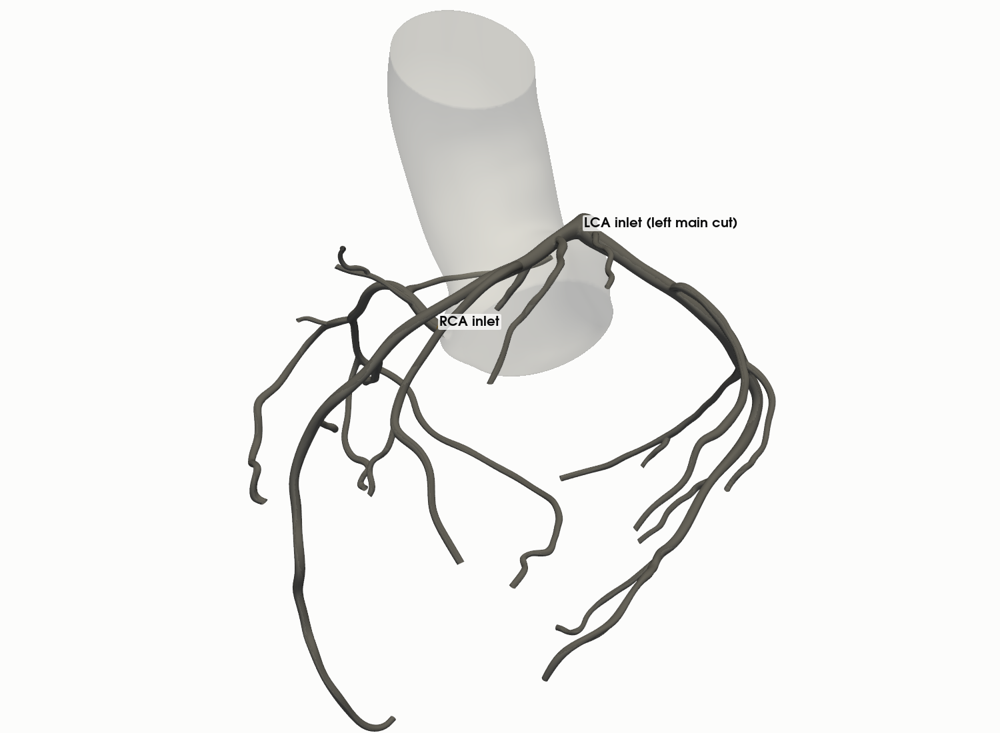

## A submodel: the coronary trees, driven by SimVascular's own boundary data

The aorta is not what zvCFD is for, and zvCFD's coronary outlet models
arrived after this comparison was set up. So the comparison uses the
standard *submodel* technique. The left and right coronary trees
are cut from the aorta, and both codes' solutions are compared inside the
cut trees, with zvCFD driven by SimVascular's own solution on the
boundaries:

- **Cuts.** A plane across the left main, 1.8 cm along the LAD centreline
  (past the ostial funnel, where the section is clear of the aortic sinus
  wall, and 6 mm before the LAD/LCX bifurcation); and a plane across the
  proximal RCA, 0.95 cm along its centreline (6.5 mm before its first
  branch). Each plane cuts only its own vessel; the surface is clipped
  there and the hole capped as an inlet (`benchmarks/simvascular/vmrcase.py`).
  The trees hold 3.24 cm³ of lumen.
- **Inlets.** SimVascular's flow through each cut, which for rigid walls
  equals the sum of that tree's outlet flows at every instant (checked:
  0.04 % apart), imposed as a flow-rate-controlled velocity inlet with
  SimVascular's own velocity profile on the cut, interpolated to each
  inlet voxel every 5 ms.
- **Outlets.** SimVascular's mean pressure over each of the 24 outlet
  caps, every 5 ms, less a reference `p_ref(t)` (the mean over the 24
  outlets). A uniform `p_ref(t)` changes nothing in incompressible flow
  and keeps the lattice density near 1.

Both codes then solve the same Navier–Stokes problem in the same domain
with the same boundary data. The outlet flows, the pressure at the inlets,
the velocity field and the wall shear stress are all predictions to
compare. Because the outlets hold pressures rather than resistances, the
outlet flows are a demanding test. The pressure differences that drive
them are a few hundred pascals, and a small error in any branch's
resistance moves its flow.

## zvCFD setup

The capped surface is voxelised directly (`zvcfd.geometry.voxelize_mesh`),
at 100, 80 and 60 µm. The two inlets are velocity patches. The 24
outlets are pressure outlets on the lattice links that cross each cap
([Boundary conditions](../spec/boundary_conditions.md#pressure-outlets-on-caps-patch-links)).
Newtonian blood as in SimVascular. The lattice velocity is 0.05 at
0.5 m/s (about the peak coronary velocity), so dt = dx / 10 m/s, the
lattice Mach number stays below 0.1, and a 1 kPa pressure difference is
a 2.7 % density difference. The boundary data are ramped up over the
first 0.1 s from rest. The solution is periodic after one cycle: over a
three-cycle run, the outlet means changed by 6 × 10⁻⁵ between cycles 2
and 3. So every run is two cycles, and the second is compared with
SimVascular's last.

| Run | Fluid voxels | τ | dt (µs) | Steps per cycle | Solve time per cycle | MLUPS |
|---|---:|---:|---:|---:|---:|---:|
| 100 µm | 3.24 M | 0.5111 | 9.80 | 102,000 | 9 min | 587 |
| 100 µm, u_lat 0.07 | 3.24 M | 0.5157 | 13.89 | 72,000 | 6 min | 661 |
| 80 µm | 6.32 M | 0.5140 | 7.94 | 126,000 | 18 min | 741 |
| 60 µm | 14.98 M | 0.5187 | 5.95 | 168,000 | 51 min | 828 |
| 100 µm, parabolic inlet | 3.24 M | 0.5111 | 9.80 | 102,000 | 8 min | 680 |

Voxel counts equal the lumen volume to 0.01 %. Every outlet is 10–18
voxels across at 100 µm and 17–30 at 60 µm. SimVascular's mesh has 3–4
linear elements across the same branches. The RTX A2000 was shared with
another job during some runs, so the times are upper bounds.

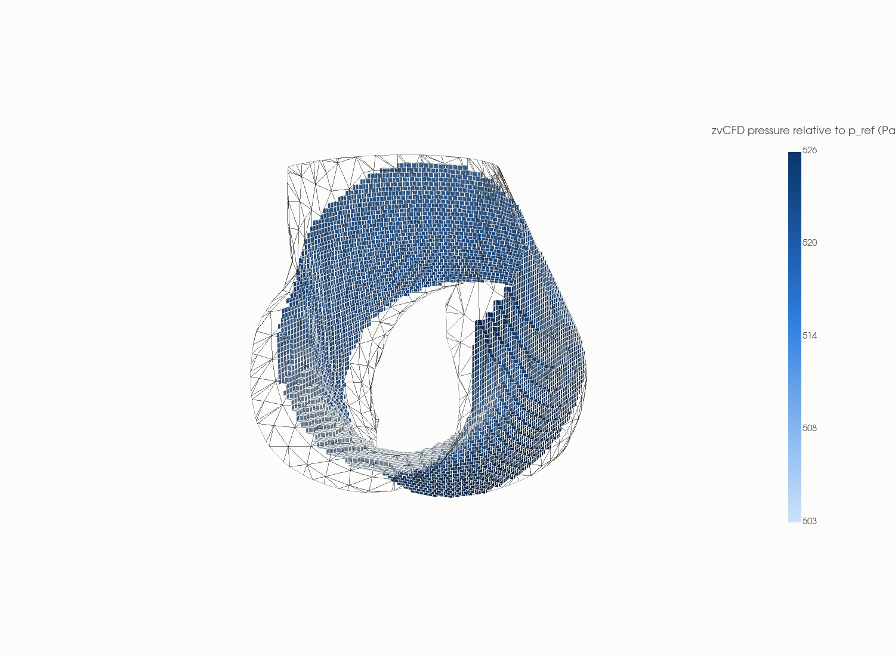

## Results

### Boundary data and the pressure drop

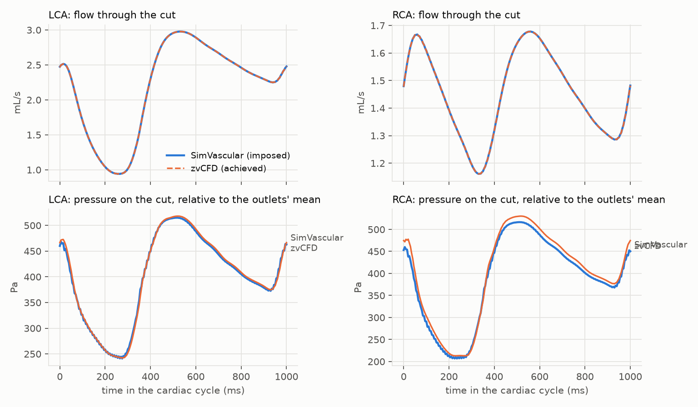

zvCFD's flow control delivers SimVascular's inflow waveform exactly. The
pressure each code needs at the inlets to drive that flow through the
trees follows the same waveform. At 60 µm it agrees to 0.4 % across the
left tree and 2.8 % across the right, falling from 0.9 % and 5.7 % at
100 µm. Along the main vessels the two codes' pressures lie on top of
each other:

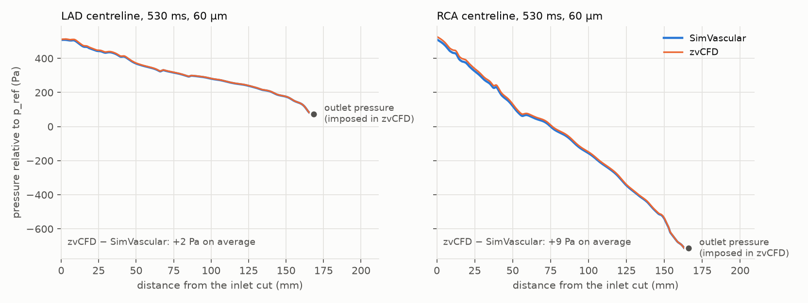

### Outlet flows

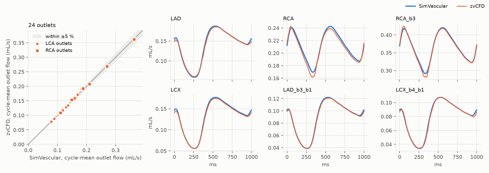

| Run | Outlet mean flow, mean / max \|diff\| | Outlet waveform, median | Split, mean \|diff\| LCA / RCA | Pressure drop LCA / RCA | Velocity, sections | Velocity, volume | TAWSS (r) |
|---|---:|---:|---:|---:|---:|---:|---:|
| 100 µm | 2.3 / 7.2 % | 2.5 % | 0.14 / 0.28 pp | +0.9 / +5.7 % | 12.1 % | 5.9 % | 10.2 % (0.990) |
| 100 µm, u_lat 0.07 | 2.3 / 7.2 % | 3.8 % | 0.14 / 0.29 pp | +0.9 / +5.8 % | 12.2 % | 6.0 % | 10.4 % (0.990) |
| 80 µm | 1.8 / 5.8 % | 2.2 % | 0.11 / 0.21 pp | +0.4 / +4.3 % | 11.9 % | 5.6 % | 7.5 % (0.993) |
| 60 µm | 1.3 / 4.2 % | 1.9 % | 0.08 / 0.16 pp | +0.4 / +2.8 % | 11.9 % | 5.4 % | 5.8 % (0.995) |
| 100 µm, parabolic inlet | 2.2 / 6.9 % | 2.5 % | 0.14 / 0.28 pp | +1.2 / +6.0 % | 17.7 % | 7.3 % | 10.3 % (0.989) |

Differences are relative L2 norms unless stated. Outlet flows: the
cycle-mean flow out of each outlet against SimVascular's, and the
waveform over the cycle, normalised by the outlet's mean flow. Split:
each outlet's share of its tree's inflow. Pressure drop: the mean inlet
pressure over the cycle, relative to `p_ref`. Velocity: six
cross-sections every 5 ms, and every fluid voxel at four phases.

The cycle-mean outlet flows agree to 1.3 % on average at 60 µm, and every
outlet is within 4.2 %. The waveforms have the same shape and phase
through the cycle, within 1.9 % (median). The two checks at 100 µm change
little:

- **Lattice velocity 0.07 instead of 0.05** (τ = 0.516 instead of 0.511):
  the outlet flows and the pressure drop are unchanged. The waveforms
  differ a little more (3.8 % against 2.5 %), because a higher lattice
  Mach number stores more mass in the lattice's compressibility as the
  pressure changes through the cycle.
- **A parabolic inlet profile instead of SimVascular's own:** the outlet
  flows move by 0.1 %. Only the left main, just past the inlet, feels it.

<details>
<summary>All 24 outlets at 60 µm</summary>

| Outlet | SimVascular (mL/s) | zvCFD (mL/s) | Difference |
|---|---:|---:|---:|
| LAD_b2 | 0.117 | 0.122 | +4.2 % |
| LAD_b4 | 0.182 | 0.190 | +4.2 % |
| LAD_b5 | 0.186 | 0.187 | +0.7 % |
| LAD_b6 | 0.170 | 0.171 | +0.9 % |
| LAD | 0.137 | 0.136 | -0.7 % |
| LAD_b3_b1 | 0.089 | 0.089 | -0.8 % |
| LAD_b3 | 0.164 | 0.162 | -1.3 % |
| LAD_b1 | 0.117 | 0.116 | -0.8 % |
| LCX_b1 | 0.102 | 0.102 | -0.2 % |
| LCX_b2 | 0.106 | 0.106 | -0.5 % |
| LCX_b3 | 0.128 | 0.126 | -1.0 % |
| LCX | 0.130 | 0.128 | -1.5 % |
| LCX_b7 | 0.118 | 0.117 | -1.1 % |
| LCX_b6 | 0.110 | 0.108 | -1.8 % |
| LCX_b5 | 0.108 | 0.108 | -0.6 % |
| LCX_b4_b1 | 0.079 | 0.078 | -0.6 % |
| LCX_b4 | 0.137 | 0.134 | -2.0 % |
| RCA_b2 | 0.158 | 0.159 | +0.3 % |
| RCA_b1_b1 | 0.110 | 0.109 | -1.1 % |
| RCA_b1 | 0.188 | 0.192 | +2.0 % |
| RCA_b3_b1 | 0.149 | 0.153 | +2.7 % |
| RCA_b3 | 0.364 | 0.362 | -0.6 % |
| RCA_b4 | 0.271 | 0.269 | -0.6 % |
| RCA | 0.211 | 0.207 | -1.5 % |

</details>

### Velocity

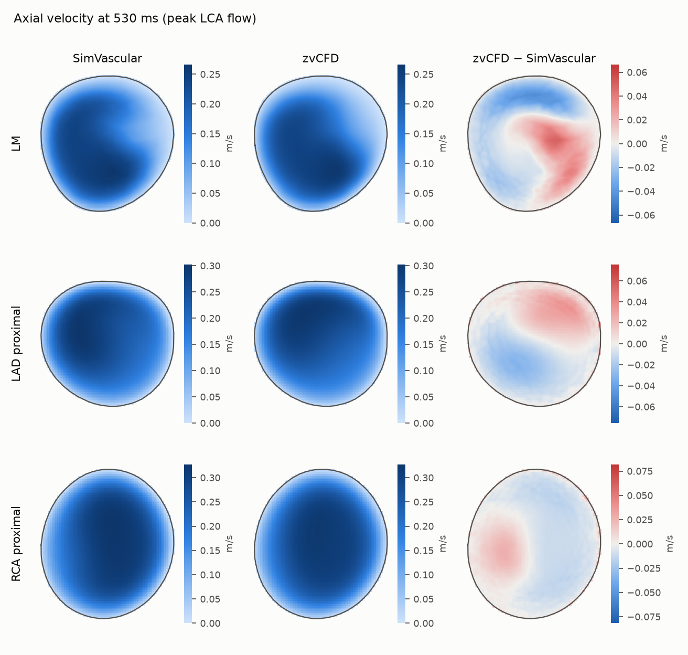

Over the whole fluid volume at four phases (160, 265, 530 and 800 ms),
zvCFD's velocity agrees with SimVascular's to 4.9–5.8 % at 60 µm. The
peak speeds agree to 0.4 % (0.548 and 0.546 m/s at peak LCA flow). On
six cross-sections through the whole cycle the difference is 3.5–9 %,
except in the left main, 2.5 mm past the inlet cut, where it is 18 %
([why](#what-is-not-tested-here)). The comparison uses every fluid voxel
inside SimVascular's mesh: 691 of the 15 M voxels at 60 µm lie just
outside its wall.

### Wall shear stress

SimVascular's result files carry wall-shear-stress arrays, but in this
model they are all zeros. So the time-averaged wall shear stress (TAWSS)
is computed here, two ways:

- the same near-wall estimate for both codes: the tangential velocity at
  h = 0.15 mm and 2h inside the wall along its normal,
  `τ = μ (4 u(h) − u(2h)) / 2h` (exact for a parabolic profile), every
  5 ms;
- SimVascular's own: the velocity gradient of the tetrahedron behind each
  wall triangle, `μ (∇u + ∇uᵀ) · n`, tangential part.

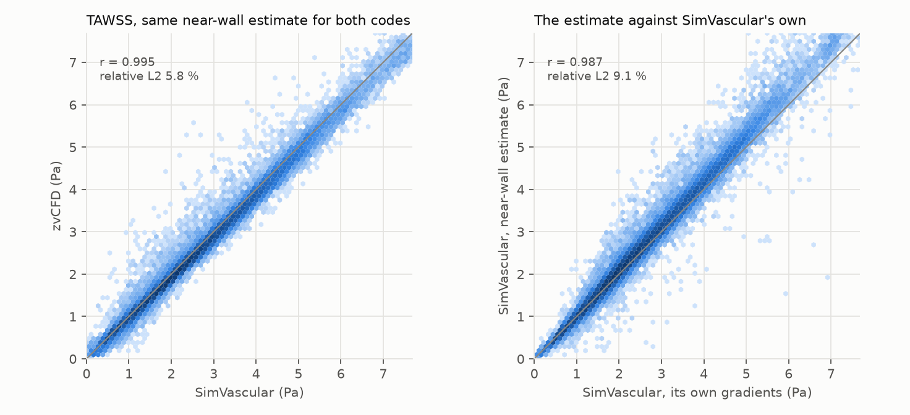

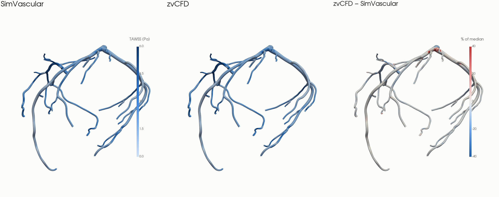

With the same estimate, zvCFD's TAWSS agrees with SimVascular's to
10.2 % at 100 µm, 7.5 % at 80 µm and 5.8 % at 60 µm (r = 0.995; median
point difference 4.3 %). The two SimVascular estimates differ from each
other by 9.1 % (r = 0.99). That is the scale of SimVascular's own
gradient error, with 3–4 linear elements across a vessel: at 60 µm,
zvCFD is closer to SimVascular than SimVascular's two estimates are to
each other. The maps agree branch by branch. Both maps share one colour
scale, and the charts use the 60 µm run.

### Convergence

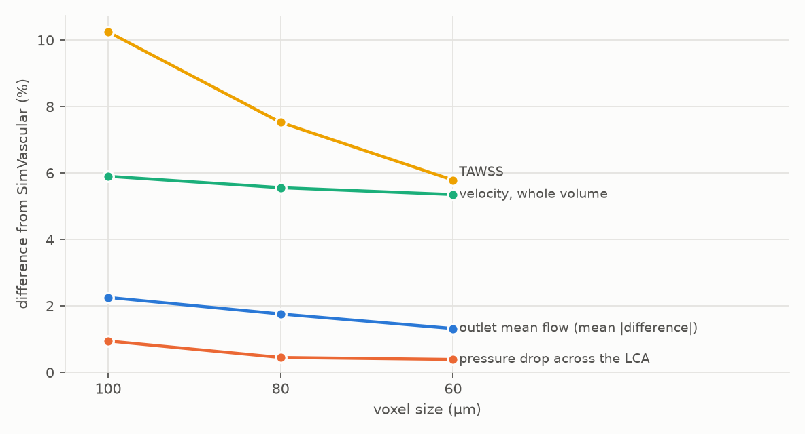

zvCFD against its own 60 µm run:

| Run | Outlet mean flow, mean / max \|diff\| | Inlet pressure LCA / RCA | TAWSS |
|---|---:|---:|---:|
| 100 µm | 1.0 / 2.8 % | +0.6 / +2.8 % | 6.7 % |
| 80 µm | 0.5 / 1.5 % | +0.1 / +1.5 % | 3.4 % |

zvCFD converges: from 80 to 60 µm its outlet flows move 0.5 % on average
and its TAWSS 3.4 %, about half as much as from 100 µm. Every difference
from SimVascular shrinks with it. The remaining velocity and TAWSS
differences are within SimVascular's own gradient error at its
published resolution.

## Pressure outlets on oblique caps: found and fixed

The first version of this comparison, with zvCFD's original outlets,
did not agree this well. The pressure drop across the trees was 10–18 %
higher in zvCFD, and a few outlets differed by 20–28 %, at every
resolution. The pressure along the main vessels showed where that came
from:

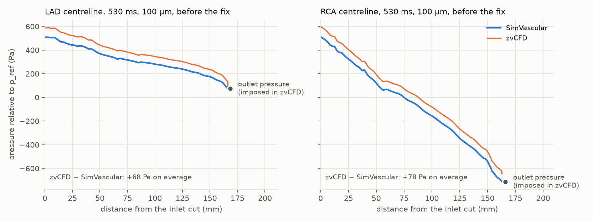

The pressures fell with the same gradient but were offset by 60–85 Pa, and
the offset appeared at the outlets. zvCFD's outlet voxels held exactly
the imposed pressures, but the fluid one voxel inside was 5–110 Pa
higher (48 Pa on average at 100 µm). A jump at every outlet lifted the
whole field and raised the inlet pressure. Because it differed from
outlet to outlet, it also shifted the flow between neighbouring outlets.

**A straight pipe isolated it** (`benchmarks/simvascular/oblique_outlet.py`).
The pipe has radius 8 voxels and length 160, is voxelised from a
triangulated surface with pressure outlets on both caps, and runs along
the lattice z axis and along oblique directions. In Poiseuille flow the
pressure is linear along the axis, so the fit over the middle half,
extrapolated to each cap, gives the pressure the flow feels there.

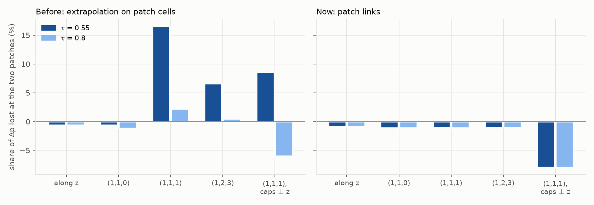

| Pipe axis (caps normal to it) | τ | Δp lost at the two caps, before | after | Flux vs Hagen–Poiseuille at the imposed Δp, before | after |
|---|---:|---:|---:|---:|---:|
| along z | 0.55 / 0.8 | −0.6 / −0.6 % | −0.9 / −0.9 % | +5.3 / +5.3 % | +5.6 / +5.6 % |
| (1,1,0) | 0.55 / 0.8 | −0.6 / −1.2 % | −1.2 / −1.1 % | −1.1 / −0.5 % | −0.6 / −0.6 % |
| (1,1,1) | 0.55 / 0.8 | 16.6 / 2.2 % | −1.1 / −1.1 % | −19.3 / −5.4 % | −2.2 / −2.2 % |
| (1,2,3) | 0.55 / 0.8 | 6.6 / 0.5 % | −1.1 / −1.1 % | −11.0 / −5.2 % | −3.7 / −3.7 % |

The original outlets used Guo's non-equilibrium extrapolation. Each
outlet voxel took the non-equilibrium part of one neighbour, the one
along the lattice link nearest the cap normal. Where the flow crossed the
outlet off the lattice axes, that lost part of the imposed pressure, and
the loss grew as τ approached ½: 17 % of the pressure difference in a
(1,1,1) pipe at τ = 0.55. Every outlet of a vessel tree is oblique, and
these runs use τ = 0.511–0.519.

**The fix** carries the pressure on the lattice links that cross each cap,
the way walls carry no-slip on the links into solid. For every link from
a fluid voxel across the cap (found by intersecting the link with the
cap's triangles), the population arriving at the fluid voxel is set by
anti-bounce-back, `f_q = −f*_q̄ + 2 w_q ρ_b [1 + 4.5 (c_q·u)² − 1.5 u²]`.
That imposes the pressure half a link out, at the cap, for any orientation
and any τ. The pipes now lose 0.5 % per cap whatever their direction
and τ: the staircase placement of the cap, fixed for a given geometry.
The remaining flux differences are the staircase walls, the same with
either outlet. The chart's last pair of bars is a pipe along (1,1,1)
cut by caps normal to z. A cap tilted 55° to the flow is not an isobar
in Poiseuille flow, so one pressure imposed over it changes the problem
itself. After the fix, that case no longer depends on τ either. [Boundary conditions](../spec/boundary_conditions.md#pressure-outlets-on-caps-patch-links)
has the details, and `tests/test_outlets.py` checks the pipe, the flux
and multi-GPU bit-identity.

On the coronary trees the fluid at each cap now sits within 2 Pa of the
imposed pressure (it was up to 110 Pa above):

| Run | Outlet mean flow, mean / max \|diff\| | Split LCA / RCA | Pressure drop LCA / RCA | TAWSS |
|---|---|---|---|---|
| 100 µm, before | 7.6 / 27.8 % | 0.52 / 0.64 pp | +13.2 / +17.8 % | 11.7 % |
| 100 µm, after | 2.3 / 7.2 % | 0.14 / 0.28 pp | +0.9 / +5.7 % | 10.2 % |
| 80 µm, before | 7.4 / 25.9 % | 0.51 / 0.65 pp | +11.7 / +14.6 % | 9.3 % |
| 80 µm, after | 1.8 / 5.8 % | 0.11 / 0.21 pp | +0.4 / +4.3 % | 7.5 % |
| 60 µm, before | 7.3 / 26.0 % | 0.52 / 0.50 pp | +10.2 / +11.1 % | 7.8 % |
| 60 µm, after | 1.3 / 4.2 % | 0.08 / 0.16 pp | +0.4 / +2.8 % | 5.8 % |

What was ruled out before the fix was found:

| Candidate | Test | Result |
|---|---|---|
| Inlet velocity profile | parabolic against SimVascular's own, 100 µm | outlet flows, pressure drop and TAWSS unchanged to 0.2 % |
| Resolution | 100 → 80 → 60 µm | outlet-flow differences stayed at 7.3–7.6 %; the jump shrank (48 → 42 → 36 Pa) only because τ rises with refinement at fixed lattice velocity |
| Lattice Mach number and τ | u_lat 0.05 → 0.07 (τ 0.511 → 0.516), 100 µm | the pressure-drop difference fell from 13 % to 10 %: the jump shrank as τ rose, as on the pipe |
| Gaps in the outlet voxel layer | fluid voxels closer to the cap than the outlet voxels | none, at any outlet |
| Geometry | voxel volume against the surface's | equal to 0.01 % |

## Renderings of the zvCFD solution

Streamlines at 530 ms (peak LCA flow), traced through zvCFD's own voxel
velocity field (trilinear interpolation, second-order Runge–Kutta), from
500 points on the two inlets:

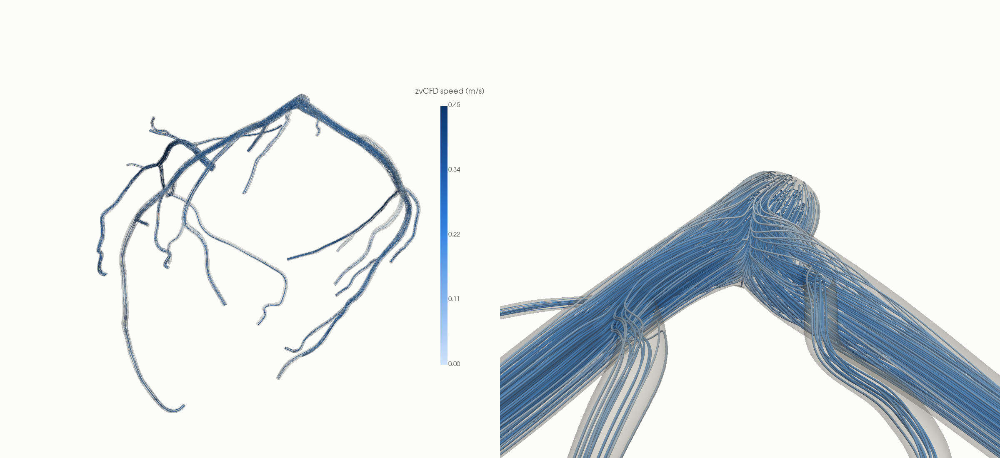

## What this shows

- **Agreement.** On a patient coronary tree, through a whole cardiac
  cycle, zvCFD reproduces SimVascular's outlet flows to 1.3 % on average,
  its flow splits to a tenth of a percentage point, its pressure drop to
  0.4–2.8 %, its velocity field to 5.4 % and its wall shear stress to
  5.8 % at 60 µm. All of these shrink with refinement. The velocity and
  wall-shear differences are within SimVascular's own gradient error at
  its published resolution.
- **Validation found a defect.** zvCFD's original pressure outlets lost
  pressure wherever they cut the voxels obliquely at low τ. That is a
  defect in zvCFD, not a difference of method: it appears on a straight
  pipe, where the exact answer is known. The new outlets impose the
  pressure on the links that cross the cap and are accurate for any
  orientation and τ. The straight-pipe case is now in the test suite.

## What is not tested here

- **SimVascular's own convergence.** It has 3–4 linear elements across
  the smallest branches, and its mesh independence is not documented in
  the VMR. A finer SimVascular run (svMultiPhysics) would separate its
  error from zvCFD's.
- **The full model.** The aorta, and zvCFD's own open-loop coronary
  outlets, are not tested: the submodel takes SimVascular's pressures at
  the outlets as given. With `zvcfd.lumped`'s coronary outlets, the same
  comparison can run on the coronary trees with SimVascular's
  intramyocardial pressures and parameters instead.
- **The left main just past the cut.** The inlet imposes only the normal
  component of SimVascular's velocity on the cut, so the secondary flow of
  the curved left main is lost there. The section 2.5 mm downstream still
  differs by 18 %, at every resolution. The other five sections differ by
  3.5–9 %.
- **Non-Newtonian blood.** SimVascular's run is Newtonian, and so is this
  comparison.

## Reproducing

```bash
pip install -e ".[simvascular]"          # pyvista, vtk, scipy, matplotlib
VMR_DIR=/path/with/10GB bash benchmarks/simvascular/run_all.sh
```

`run_all.sh` downloads the project and results (8.9 GB) from the Stanford
Digital Repository and extracts SimVascular's answers (`svref.py`). It
then runs zvCFD at each resolution (`run_zvcfd.py`), compares
(`compare.py`, writing `benchmarks/results/simvascular/summary.json`) and
draws the figures (`figures.py`, `renders.py`). The tables on this page
are printed by `report.py`, and the straight-pipe test is
`oblique_outlet.py`; the runs from before the outlet fix are kept for the
before/after tables (`summary_neem.json`). The zvCFD runs take about 4 h
on one RTX A2000, 1.7 h of it the 60 µm run, plus the download.

The VMR data is used under its licence, with the acknowledgement it asks
for on the [References](../references.md#simvascular) page.
