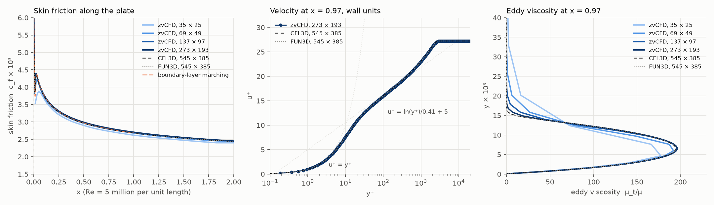
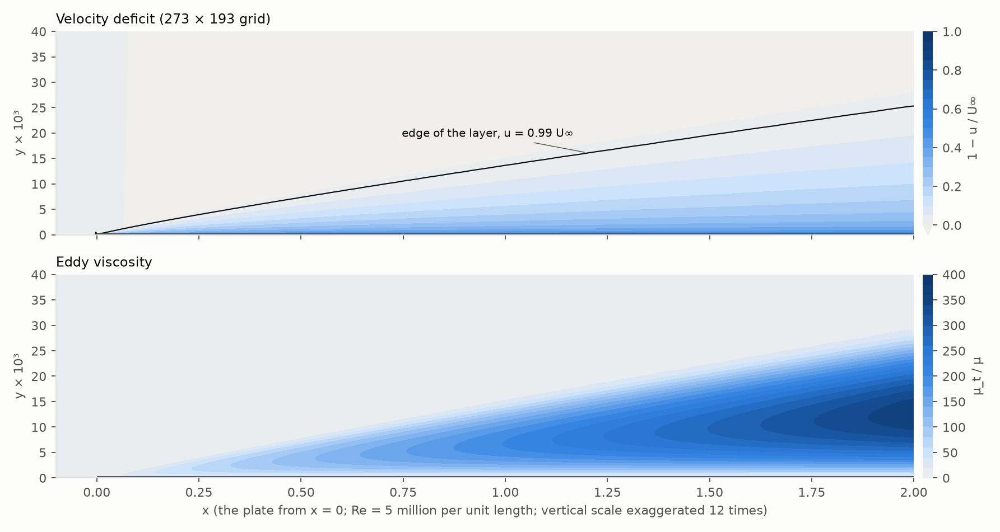
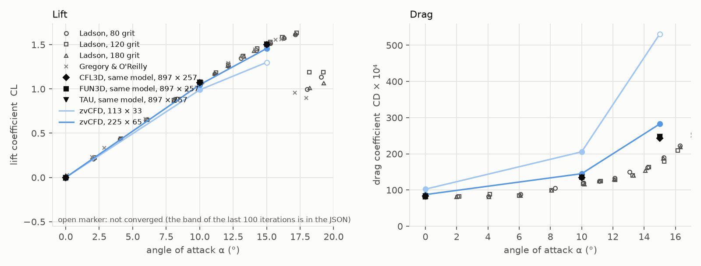
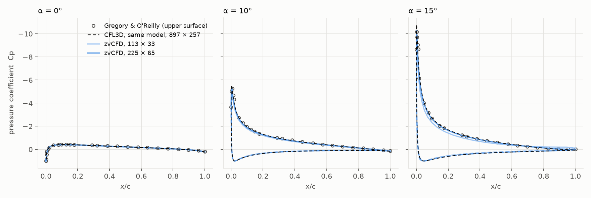
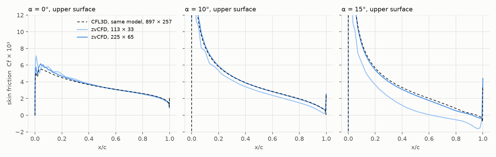
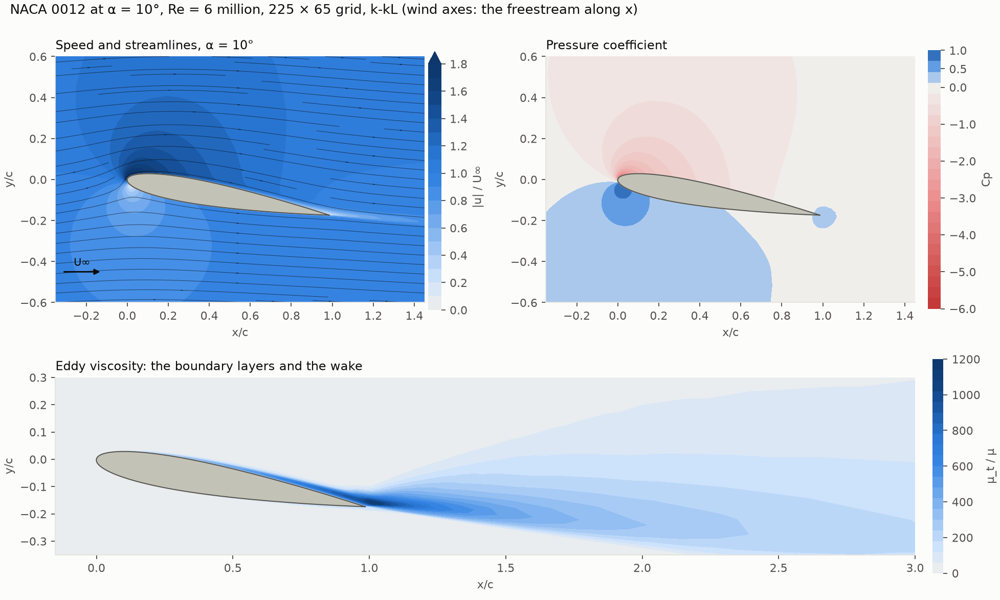
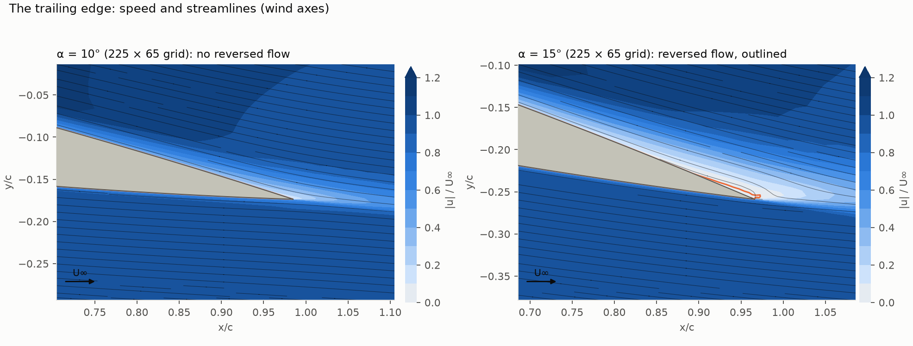

# Turbulent flow: flat plate and NACA 0012

**Status (2 October 2026).** These cases verify and validate the k-kL
turbulence model of the finite-volume solver (`zvcfd.fv.turbulence`,
k-kL-MEAH2015m; [specification](../spec/turbulence.md)) on the NASA
Turbulence Modeling Resource's (TMR) two-dimensional cases: the
zero-pressure-gradient flat plate and the NACA 0012 airfoil at Re = 6
million. The same equations are also solved by two independent programs
that share no code with zvCFD: a one-dimensional channel solver and a
boundary-layer marching code. A three-dimensional wing (the ONERA M6 at low
speed) is prepared but not yet run: see [ONERA M6](#onera-m6-at-low-speed).

The cases are in `benchmarks/turbulence/`: `flat_plate.py`, `naca0012.py`,
`channel_fv.py`, the references `channel_1d.py` and `plate_bl.py`, and the
grids `meshes.py` (the Resource's Plot3D grids, one cell deep). Raw results
are in `benchmarks/results/turbulence/`, with the solution on the z = 0
plane in `fields_*.npz`. `figures.py` makes the figures and `summary.json`,
and `renders.py` the renderings of the fields. The grids and experimental
data come from the Resource (`TMR=/hdd/data/zvcfd_turb`).

---

## Summary

| Case | Reference | Exercises | Result |
|---|---|---|---|
| Fully developed channel, Re_τ = 942 and 5000 | an independent 1-D solver of the same equations; Dean's correlation | the model's equations, the wall terms, the log layer | the 1-D solver gives c_f 0.00324 at Re_τ = 5000 (Dean 0.00327); zvCFD at Re_τ = 941: U_c/U_b within 0.03 %, c_f 3.5 % low on a coarser grid |
| Flat plate, Re = 5 million per unit length | CFL3D and FUN3D with the same model on the same grids (NASA TMR); boundary-layer marching of the same equations | wall layers, leading edge, transition from the freestream turbulence, u⁺ and μ_t profiles | c_f(0.97) **0.002717** on the 273 × 193 grid, extrapolated 0.002718, against 0.002692 from CFL3D and FUN3D (+0.96 %; +0.26 % normalised by each code's edge velocity); peak μ_t/μ 196.3 against 194.7 and 194.9 |
| NACA 0012, Re = 6 million, α = 0, 10, 15° | CFL3D, FUN3D and TAU with the same model (NASA TMR, 897 × 257); Ladson (1988), Gregory & O'Reilly (1970) | lift, drag, surface pressure and skin friction, a trailing edge near separation at 15° | on 225 × 65: Cp and Cf on CFL3D's; CL 2.6–3.0 % low, CD 5–15 % high, both converging towards the NASA codes from 113 × 33 |

---

## The same equations, solved independently

Before the finite-volume results mean anything, the model has to be the
right model. Two small programs solve k-kL-MEAH2015m's equations on their
own, with their own discretisations: they check the transcription of the
model, and give references with no discretisation error worth speaking of.

**Channel (`channel_1d.py`).** Half a fully developed channel in wall
units, 160 stretched nodes (the first at y⁺ = 0.3), pseudo-time to a
change of 10⁻¹⁰. The total shear stress of a converged channel is exactly
`1 − y`. The solver reproduces it to 10⁻⁹.

| Re_τ | Re_b | c_f | Dean (1978) | U_c/U_b | Dean | κ fitted to the log layer |
|---|---|---|---|---|---|---|
| 942 | 39,376 | 0.00458 | 0.00518 | 1.153 | 1.132 | 0.313 |
| 5000 | 248,427 | 0.00324 | 0.00327 | 1.126 | 1.108 | 0.354 |

At Re_τ = 5000 the model is within 1 % of Dean's friction law. At 942 it
is 12 % low, and its log layer has an effective κ of 0.31. That is the
model, not the solver: the 1-D solution has no discretisation error at this
level. At this Reynolds number, `L_vK` and the wall terms still act across
most of the layer.

zvCFD's finite-volume solver ran the same channel at Re_b = 40,000 (Re_τ =
941): 64 cells across the full height, tanh-stretched to y⁺ = 2 at the
first node, the inflow profiles recycled from three quarters of the way
down a 20-half-height channel until they stopped changing. Its U_c/U_b is
1.1532, against the 1-D solver's 1.1529. Its c_f, from the first node's
velocity gradient, is 0.00442, 3.5 % below the 1-D 0.00458. The 1-D solver
puts 160 nodes in half the channel; zvCFD puts 32 there.

**Flat plate (`plate_bl.py`).** The incompressible boundary-layer
equations with the same closure (`U' = |∂u/∂y|`, `U'' = |∂²u/∂y²|`,
`d = y`), marched in x (backward Euler, Picard iterations at each station,
tridiagonal solves in y), from x = 10⁻⁵ to 1, 240 nodes across the layer.
It gives c_f(0.97) = 0.002695 at Re_θ = 7,700. CFL3D and FUN3D give
0.002692 on the Resource's finest grid, and Karman–Schoenherr 0.00277.

---

## Flat plate (NASA TMR 2DZP)

The Resource's zero-pressure-gradient plate: x from −1/3 to 2, the plate
from x = 0, Re = 5 million per unit length, and the Resource's farfield
turbulence for M = 0.2 (`k∞ = 9 × 10⁻⁹ a∞²`, `Φ∞ = 1.5589 × 10⁻⁶ μ a∞/ρ`,
`μ_t/μ = 0.009`). The Resource's grids are extruded one cell deep, with a
span of four wall spacings. The inlet has a velocity inlet; the top and the
outlet are pressure boundaries; ahead of the plate is a symmetry plane.
The flow's linear systems are solved directly (`linear: host-direct`): on
one-cell slabs the iterative solvers stall once the eddy viscosity is on
([Meshes](../spec/turbulence.md#meshes)). The false time step grows from
0.05 to 1. The runs stop when the relative changes of u, p, k, Φ and μ_t
all fall below 10⁻⁸.

The Resource publishes this model's results from CFL3D and FUN3D on the
same family of grids (its K-kL-MEAH2015m flat-plate page; the data are in
`$TMR/kkl_reference/`). zvCFD's c_f(0.97) beside them, grid by grid:

| Grid | zvCFD | CFL3D | FUN3D | zvCFD iterations, wall time |
|---|---|---|---|---|
| 35 × 25 | 0.002629 | 0.002623 | 0.002675 | 178, 43 s |
| 69 × 49 | 0.002690 | 0.002670 | 0.002697 | 172, 5 min |
| 137 × 97 | 0.002712 | 0.002688 | 0.002690 | 241, 61 min |
| 273 × 193 | **0.002717** | 0.002691 | 0.002691 | 148, 9.0 h |
| 545 × 385 | | **0.002692** | **0.002692** | |
| boundary-layer marching (same model) | 0.002695 | | | |



On the two coarser grids zvCFD lies between the two NASA codes. On the
finer ones it settles above them. Its sequence rises by 0.000061, 0.000022
and 0.0000046, an observed order of 2.2 over the last two refinements, and
extrapolates to 0.002718. That is 0.96 % above the NASA codes'
grid-converged 0.002692. The gap does not close with refinement.

Most of it is the flow outside the layer, not the layer. At x = 0.97, three
boundary-layer thicknesses from the wall, zvCFD's flow runs at
1.0018 U∞, and CFL3D's and FUN3D's at 0.9985 U∞. zvCFD fixes the velocity
at the inlet and the pressure at the top and the outlet. Its wall pressure
falls from 0.0016 ρU∞² at x = 0.1 to zero along the plate, so the outer
flow speeds up slightly as the layer displaces it. The NASA codes run
compressible at M = 0.2 with their own inflow and far-field conditions.
The Resource notes that variations of these "may also work and yield
similar results". Skin friction scales with the square of the edge
velocity. Normalised by each code's own edge velocity, c_f/(u_e/U∞)² is
0.002707 for zvCFD on 273 × 193 against 0.002700 for both NASA codes: a
difference of 0.26 %. The boundary-layer marching code, which shares
nothing with any of the three and has u_e = U∞ exactly, agrees with the
NASA codes to 0.1 %, which confirms the model's transcription.

Along the plate the 69 × 49 and 137 × 97 solutions lie on CFL3D's and
FUN3D's from x = 0.05 onward. Near the leading edge, transition from the
freestream turbulence happens within the first few hundredths of the plate
in all of them. At x = 0.97 the velocity profile in wall units follows the
NASA codes across the viscous sublayer, the buffer layer and the log
layer, out to the edge of the layer at y⁺ ≈ 3,000. The eddy viscosity
profile is the most searching check of a turbulence model's
implementation. zvCFD's peaks at μ_t/μ = 196.3 on the 273 × 193 grid
(196.2 on 137 × 97), against 194.7 (CFL3D) and 194.9 (FUN3D) on
545 × 385, at the same height.
The coarser grids smear only the layer's outer edge, where the grid is
coarsest.

The wall time is the direct solver's: SuperLU on the host, factorising the
coupled 4 × 4 system every iteration. It is not the GPU solver's speed.

### The boundary layer



The boundary layer grows from the leading edge to δ₉₉ = 0.0133 at
x = 0.97 (CFL3D and FUN3D: 0.0136) and 0.0253 at the end of the plate (the
vertical scale is exaggerated 12 times). The eddy viscosity is zero at the wall, where `μ_t`
vanishes with `k` and `Φ`. It rises through the log layer to its peak at
half the layer's thickness (μ_t/μ = 196 at x = 0.97, 355 at x = 2), and
falls steeply at the layer's edge. Above it, the Resource's freestream
turbulence has no shear to feed on: its μ_t/μ decays from 0.009 at the
inlet to 0.003 over the plate.

---

## NACA 0012 (NASA TMR 2DN00)

The Resource's two-dimensional validation case is the NACA 0012 at
Re = 6 million on the chord, M = 0.15 (run incompressible), α = 0°, 10°
and 15°. It uses the Resource's family of C-grids, with the farfield 500
chords away, extruded one cell deep (span four wall spacings). The first
nodes are at y⁺ ≈ 2.3 on the 113 × 33 grid and 0.95 on 225 × 65. The C
boundary takes the freestream velocity, and its downstream ends are
pressure boundaries. The farfield turbulence is the Resource's at M = 0.15.
The flow is solved directly, with the false time step ramped from 0.05 to
20, since the far field is far away. The runs stop at relative changes of
10⁻⁶: the turbulence's changes level off at a few 10⁻⁷. Lift and drag
come from the consistent reactions on the airfoil. The surface integral of
pressure and wall shear stress gives a second value and the split into
pressure and viscous drag. Every five iterations the reactions are
recorded, and the JSON keeps the band over the last 100.

The references are:

- **The same model in three NASA and DLR codes** (the Resource's
  K-kL-MEAH2015m NACA 0012 page; 897 × 257 grid, M = 0.15). CFL3D's
  lifting results use a point-vortex farfield correction:

  | α | CL (CFL3D / FUN3D / TAU) | CD (CFL3D / FUN3D / TAU) |
  |---|---|---|
  | 0° | 0 | 0.00831 / 0.00827 / 0.00836 |
  | 10° | 1.0700 / 1.0767 / 1.0772 | 0.01341 / 0.01358 / 0.01358 |
  | 15° | 1.4980 / 1.5048 / 1.5040 | 0.02428 / 0.02473 / 0.02477 |

  CFL3D's surface pressure and skin friction come with them
  (`$TMR/kkl_reference/`).
- **Experiment**: Ladson (1988, NASA TM 4074) measured lift and drag at
  M = 0.15 and Re = 6 million with transition tripped. Gregory &
  O'Reilly (1970, R&M 3726) measured upper-surface pressure at Re = 2.88
  million, digitised and approximate.

zvCFD's results, lift and drag from the reactions; the surface integral's
drag and its split beside them:

| Grid | α | CL | CD | CD, surface (pressure + viscous) | Iterations, wall time |
|---|---|---|---|---|---|
| 113 × 33 | 0° | 0 | 0.01023 | 0.00974 (0.00250 + 0.00724) | 233, 18 min |
| 113 × 33 | 10° | 0.9890 | 0.02054 | 0.01947 (0.01317 + 0.00630) | 253, 14 min |
| 113 × 33 | 15° | 1.286–1.300, not converged | 0.0531–0.0538 | 0.0515 (0.0473 + 0.0043) | 1,000, 52 min |
| 225 × 65 | 0° | 0 | **0.00873** | 0.00866 (0.00150 + 0.00716) | 226, 2.2 h |
| 225 × 65 | 10° | **1.0468** | **0.01450** | 0.01429 (0.00737 + 0.00691) | 286, 2.7 h |
| 225 × 65 | 15° | **1.4565** | **0.02825** | 0.02781 (0.02178 + 0.00602) | 615, 5.8 h |
| CFL3D / FUN3D / TAU, 897 × 257 | 0°, 10°, 15° | 0; 1.070–1.077; 1.498–1.505 | 0.0083; 0.0134–0.0136; 0.0243–0.0248 | | |







On the 225 × 65 grid the surface pressure lies on CFL3D's at all three
angles, suction peak included, and on Gregory & O'Reilly's measurements.
The skin friction lies on CFL3D's at 0° and 10°. At 15° it is slightly low
over the rear half, and ends in the same small region of reversed flow at
the trailing edge.

The integrated forces converge towards the NASA codes' as the grid is
refined, and are not there yet on 225 × 65. That grid is a quarter of
theirs in each direction. Lift is 2.6 % low at 10° and 3.0 % low at 15°,
up from 8.0 % and 13 % on 113 × 33. Drag is 5 % high at 0°, 7 % at 10° and
15 % at 15°, down from 23 %, 52 % and more than 100 %. The excess is almost
all pressure drag. Its source shows on the coarse grid: the pressure
recovers to Cp = 0.105 at the trailing edge at 10°, against 0.16–0.18 in
CFL3D, the signature of a boundary layer too thick there. On 113 × 33 at
15° that layer separates over the rear 40 % of the chord, and the run oscillates
(lift between 1.286 and 1.300 over its last 100 iterations) instead of
converging. Two grids do not support an extrapolation. A third level is
out of reach for now: with the direct solver, 449 × 129 takes about 400 s
per iteration, a day and a half per angle. It waits on an iterative solver
that handles one-cell slabs.

Ladson's measured drag is lower than every RANS result: 0.0120 at 10°
against 0.0134–0.0136. The measurement had transition tripped near the
leading edge, and the models are fully turbulent from it. The Resource's
comparison is of codes against each other, with the experiment as context.

On some of these runs the scalar solves of `k` and `Φ` stopped at their
iteration limit short of a 10⁻⁶ residual reduction (134 of about 450 at 0°
on 225 × 65), late in the run when the initial residual is already small.
The outer iterations converged regardless.

### The flow round the airfoil



At 10° the stagnation point sits on the lower surface at x/c = 0.023. The
flow accelerates round the nose to 2.5 U∞ at the suction peak (Cp = −5.4
at x/c = 0.003): the dark region of the speed plot, the red of the pressure
plot. It then decelerates along the upper surface. The eddy viscosity shows
the two boundary layers: thin on the lower surface, growing on the upper
one as it meets the adverse pressure gradient. At x/c = 0.98 the upper
layer is about three times as thick as the lower (0.061 against 0.019 of
the chord, where μ_t/μ exceeds 5 % of its peak across the layer). Both feed
the wake, which holds the field's highest eddy viscosity (μ_t/μ = 1,135,
0.04 chords behind the trailing edge). The wake bends slightly downward,
with the downwash behind a lifting airfoil.



At the trailing edge the upper-surface layer is far thicker than the
lower. At x/c = 0.98 it is 0.061 of the chord at 10° and 0.100 at 15°. At
15° its innermost part separates. The flow at the first node off the wall
runs backward from x/c = 0.930 to the trailing edge: a thin bubble.
CFL3D has it too, on its four-times-finer grid, from x/c = 0.956, where its
skin friction falls below zero. That thickening is what loses lift and adds
pressure drag as α rises. It is also where a coarse grid errs: on 113 × 33
the layer at 15° separates over the rear 40 % of the chord.

---

## ONERA M6 at low speed

The ONERA M6 wing (Schmitt & Charpin 1979) is the most widely used
three-dimensional wing for checking RANS solvers. Its experiment is
transonic (M = 0.84, Re = 11.72 million on the mean aerodynamic chord), so
an incompressible solver can only run the same wing at the same incidence
at low speed. `benchmarks/turbulence/onera_m6.py` builds it: the M6
planform (root chord 0.8059 m, semispan 1.1963 m, taper 0.562, leading edge
swept 30°) with the ONERA D section, in a C-H grid of hexahedra made of
NACA 0012 grid sections morphed to the D section. At Re = 1 million on the
MAC, the first node is at y⁺ ≈ 0.4.

It has not run yet. On this grid the flow's iterative linear solvers make
no progress even for laminar flow. The AmgX presets, the ACM multigrid and
the `auto` ladder all end every outer iteration at their iteration limit,
with the residual where it started, and the whole-domain mass imbalance
stays at 100 %. The grid's far-field cells are long in the plane of the
sections and thin across the span, the same anisotropy that defeats the
solvers on the one-cell slabs. The 3-D grid is too large for the direct
solver, so the M6 waits on a linear solver that handles it.

---

## Defects found on the way

Getting the flat plate to its reference turned up six problems. None was in
the model's equations, which the two independent programs had already
confirmed. Each changed the converged answer or whether there was one:

1. **Non-monotone diffusion.** The shape-function diffusion of the momentum
   equations, applied to `k` and `Φ`, gives neighbour coefficients of the
   wrong sign on stretched elements: 94 % of the rows on the flat-plate
   slab. Ahead of the plate, `k` came out as a sawtooth, from the floor to
   10⁴ times its freestream value at neighbouring nodes. It is now
   edge-based, with a lagged correction for non-orthogonal sub-faces, as
   FUN3D's: an M-matrix on any mesh.
2. **The scalar linear solver.** CuPy 13's GMRES takes the initial guess as
   its right-preconditioned variable, so with a Jacobi preconditioner it
   started from `D⁻¹x₀`. That is about 10¹¹ times the guess in the interior
   rows. Its `maxiter` counts inner iterations and it reported success
   after one restart cycle. The solves were partial, from a wrong start.
   They now use FGMRES with an AmgX V-cycle on rows scaled to a unit
   diagonal, and check their own residual.
3. **Relaxation scaled by the wrong thing.** Implicit under-relaxation of
   the whole diagonal is scaled by the diffusion across the thinnest cells
   (`Γ/h_z²` ≈ 10⁴ s⁻¹ across the slab). That made the pseudo-time step
   about 2 × 10⁻⁴ s, against the turbulence's own time scale of about
   0.03 s. The outer layer then grew by 0.5 % per iteration and had not
   settled after 2,000. Only the sources are relaxed now.
4. **Jacobi coupling of k and Φ.** With each equation settling within an
   update, solving `Φ` against the old `k` locked the two into an
   oscillation, and the turbulence collapsed every few dozen iterations.
   `Φ` is now solved with the new `k`.
5. **Linearisation.** The Picard form of the sinks (`(k^{3/2}/Φ) k` for
   `k^{5/2}/Φ`) gives the update a gain of about −2 near equilibrium.
   Newton's method for the sinks gives about −0.2, with every coefficient
   positive.
6. **The flow's linear solver on slabs.** With the eddy viscosity on, every
   iterative solver of the coupled system stalls on one-cell slabs. The
   outer loop still "converged", onto a state that misses continuity by
   more than 10 % at a tenth of the nodes, with c_f 40 % low. The
   two-dimensional cases therefore use the direct solver. The iterative
   solvers belong to the solver core and are not changed here.

---

## Reproducing

```bash
export TMR=/hdd/data/zvcfd_turb                      # the Resource's grids and data
python benchmarks/turbulence/channel_1d.py 942 5000  # the 1-D reference
python benchmarks/turbulence/channel_fv.py           # zvCFD's channel, about 20 min
python benchmarks/turbulence/plate_bl.py             # the boundary-layer reference
python benchmarks/turbulence/flat_plate.py 35 69 137 # about 70 min, mostly the 137 grid
python benchmarks/turbulence/flat_plate.py 273 --tol 1e-6   # about 9 h
python benchmarks/turbulence/naca0012.py --grid 113 225 --alpha 0 10 15 --false-dt 20
python benchmarks/turbulence/figures.py
python benchmarks/turbulence/renders.py              # the field renderings
pytest tests/test_fv_turbulence.py
```
